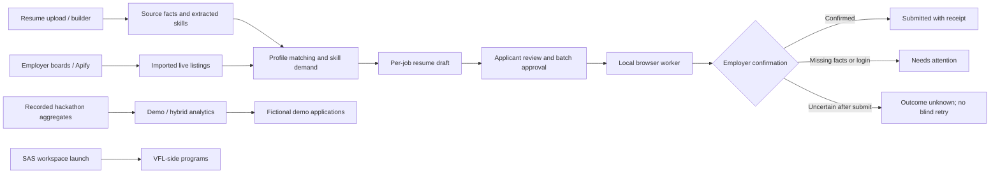
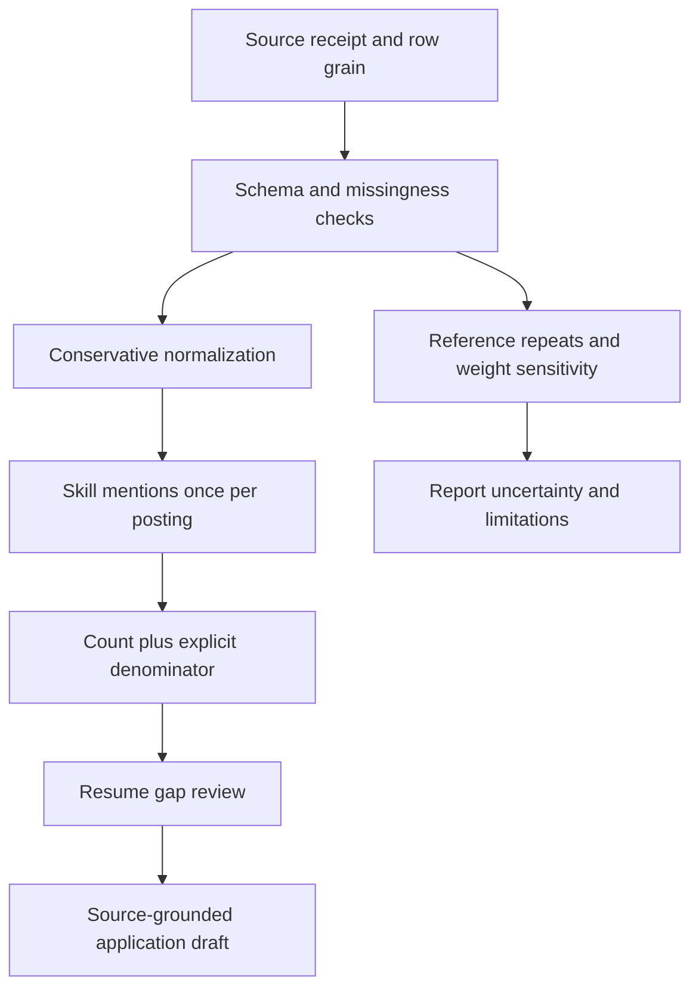
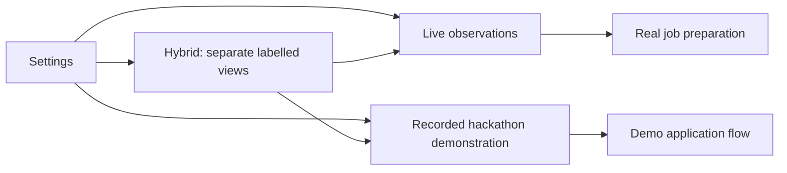

# Limit.less

### 🧭 A career workspace connecting résumé skills, job demand and applications

**Project contact:** [abhishekk-y](https://github.com/abhishekk-y) · [tuskydv1@gmail.com](mailto:tuskydv1@gmail.com)

Limit.less turns a résumé into a visible skill profile, compares it with imported job listings, prepares a separate résumé for each selected role, and tracks application outcomes. It also brings learning plans, assessments, LinkedIn content workflows and SAS research navigation into one workspace.

[📸 Screenshots](docs/showcase/screenshot-gallery.md) · [🎞️ Presentation](docs/showcase/demo-presentation.html) · [✅ Verification](docs/verification/local-delivery.md) · [🔬 Research](docs/research-basis.md) · [🚀 Local setup](#-run-locally)


## 📄 Résumé skills and market demand

Upload a PDF, DOCX or text résumé to see its extracted skill claims. Each skill shows its demand percentage and the number of imported listings mentioning it. An increase or decrease appears when comparable history exists. The text box underneath lists in-demand skills missing from that particular document.


*Screenshot: the actual interface rendered with a synthetic test résumé and a controlled ten-listing sample. Python appears in 4/10 listings (40%); SQL appears in 6/10 listings (60%) and is absent from the sample résumé. These figures demonstrate the interface, not national market statistics.*

```text
Demand percentage = listings mentioning a skill / imported active listings × 100
Historical change = current mentioning-listing count − prior comparable count
Missing skill      = supported skill mentioned in listings but not extracted from this résumé
```

DOCX paragraphs, tables and nested tables are read. Extracted claims are not certifications; missing extraction does not prove someone lacks a skill. The interface suggests reviewing evidence before adding skills to a résumé. Scanned PDFs need readable text because OCR is not configured.

## ✨ Feature map

| Feature | What the product does | Current boundary |
| --- | --- | --- |
| 📄 Application Vault | Upload, extract, download and delete résumés; show demand and missing skills | PDF/DOCX/TXT, up to 2 MB; no OCR |
| 🧬 Talent Twin | Organize claimed skills and linked evidence | Claims and verified evidence remain distinct |
| 📊 Market watch | Show skill mentions, posting counts, timestamps and daily history | Observations describe imported listings |
| 🔎 Live Jobs | Import Greenhouse/Lever boards and Apify datasets; match a profile | Provider access and listing availability vary |
| 🎓 Internships | Filter imported roles and request internship searches through Apify | Comprehensive source coverage is unverified |
| 🏛️ Government opportunities | Open official NCS, SSC and UPSC sources | Automatic government vacancy import is pending |
| 📝 Resume Builder / Apply Queue | Maintain source facts and generate per-role Gemini/OpenAI drafts | Applicant review required |
| 🤖 Local Auto-Apply | Run an approved batch through an isolated Gemini browser worker | Maximum five jobs; login/CAPTCHA/missing facts stop the run |
| 📬 Application Tracker | Track demo and live application outcomes | Confirmed, user-reported and uncertain outcomes are distinguished |
| 🗺️ Career GPS / Missions | Plan skill development and collect project evidence | Not independent certification |
| 🧪 Assessments | Practice and consent-based monitored attempts | Monitoring is not a cheating detector |
| 🔗 Skill Passport | Share expiring, revocable evidence snapshots | Explicit sharing consent |
| 💬 Social Studio | Draft, research, schedule reviewed posts and check delivery | Publora/Apify/model connections required |
| ⚙️ Data settings | Choose Hackathon demo, Hybrid or Live | Hackathon records never enter live submissions |
| 🔬 SAS workspace | Save a VFL URL, launch the workspace and explore analysis evidence | Remote execution / verified result sync pending |
| 🏢 Organization / Institution | Workforce import, team scenarios and curriculum gaps | Separate workspace journeys |

## 🖥️ Product walkthrough


*Application screenshot shows a labelled demo submission. It does not represent an employer application.*

More desktop and mobile screens are in the [screenshot gallery](docs/showcase/screenshot-gallery.md), including assessments, workforce imports, curriculum comparisons and navigation.

**[▶ Open the complete screenshot slideshow](docs/showcase/demo-presentation.html)** — all 16 captured screens are included alongside the walkthrough, with captions, keyboard arrows, next/previous controls and automatic playback. Download or clone the repository and open the HTML file in a browser to play it; GitHub displays HTML source in its file viewer.

## 🧱 Technology stack

| Layer | Technologies | Responsibility |
| --- | --- | --- |
| Interface | Next.js 15, React, TypeScript, Tailwind CSS, Lucide icons | Product screens, navigation and responsive layouts |
| Client data | TanStack Query, Axios | Fetching, refresh, loading/error states and authenticated requests |
| API | FastAPI, Pydantic, Python | Account-scoped endpoints and input validation |
| Persistence | SQLAlchemy async, Alembic, SQLite locally; PostgreSQL deployment configuration | Records, migrations and application state |
| AI writing | Gemini and OpenAI API adapters | Source-grounded résumé and social drafts |
| Job discovery | Greenhouse, Lever, Apify; optional Adzuna India | Imported job descriptions and provenance |
| Browser worker | Gemini, Playwright, ReportLab | Form actions, résumé PDFs and confirmation detection |
| Social delivery | Publora | Reviewed scheduling and provider status checks |
| Research | SAS analysis programs and aggregate evidence | Data-quality stages and documented analysis |
| Verification | pytest, Playwright, TypeScript and ESLint | API, browser, build and static checks |

## 🗂️ Source structure — which feature lives where

```text
Limit.less/
├── apps/
│   ├── web/
│   │   ├── src/app/                       # Routes: dashboard, vault, jobs, social, settings
│   │   ├── src/components/journey/        # Feature screens and user workflows
│   │   │   ├── vault.tsx                  # Résumé upload and document management
│   │   │   ├── resume-skill-demand.tsx    # Demand %, counts, change and missing-skills box
│   │   │   ├── market-ticker.tsx          # Live / hackathon / hybrid dashboard views
│   │   │   ├── apify-job-search.tsx       # Job search, internship filters and dataset imports
│   │   │   ├── local-auto-apply.tsx       # Approved batch runs and per-job results
│   │   │   ├── reach.tsx                  # Live Jobs, Apply Queue and Social Studio
│   │   │   ├── sas-workspace.tsx          # VFL address and workspace launch
│   │   │   └── settings.tsx               # Provider connections and data-source choices
│   │   ├── src/components/layout/        # Shared navigation and application shell
│   │   └── e2e/                          # Browser journeys and screenshot capture
│   └── api/
│       ├── app/main.py                   # Active API entry point
│       ├── app/runtime/                  # Mounted implementation
│       │   ├── journey.py                # Résumé reading, skill claims and learning journeys
│       │   ├── reach.py                  # Job imports, matching, packets and tailoring
│       │   ├── apify_jobs.py             # Actor runs and dataset normalization
│       │   ├── automation.py             # Local application run coordination
│       │   ├── browser_apply.py          # Employer form actions and submission receipts
│       │   ├── social_engine.py          # Content adapters, publishing and delivery checks
│       │   ├── sas_evidence.py           # Recorded aggregates and VFL workspace settings
│       │   └── platform.py               # Dashboard and data-view preferences
│       └── alembic/runtime_versions/     # Active database migrations
├── packages/scoring/                     # Skill extraction, matching and eligibility logic
├── data/seed/                            # Fictional sample inputs and curated reference data
├── tests/api/                            # API, integration and controlled submission tests
├── scripts/                              # Local launch, migration and setup helpers
├── sas-hackathon/
│   ├── sas/                              # VFL-side preparation, analysis and validation programs
│   ├── docs/                             # Data contracts, formulas, methodology and runbook
│   └── research/                         # Research questions and source notes
├── docs/
│   ├── assets/screenshots/               # Captured UI images used in this documentation
│   ├── hackathon-research/                # Source register and methodology decisions
│   ├── showcase/                         # All screenshot slides and presentation walkthrough
│   ├── verification/                     # Tested delivery and remaining dependencies
│   ├── research/                         # Formulas, interpretation and interactive evidence charts
│   ├── evidence/                         # Timestamped public feed receipts
│   └── archive/                          # Historical project notes; not current status
└── .local/                               # Private local database/runtime files; ignored by Git
```

The active API is `app/runtime`, mounted from `app/main.py`. Older API modules are retained as reference and are not mounted. Existing SkillSetu database identifiers remain for compatibility; the visible product name is Limit.less.

## 🔄 Implementation approach



Job imports retain their provider, source URL, collection timestamp and posting date where available. Skill matching uses the supported taxonomy. Writing prompts constrain drafts to supplied source facts. Auto-Apply records success only after a new employer confirmation appears; uncertain post-submit outcomes do not trigger automatic retries. Social delivery status comes from the provider response rather than a local scheduling label.

## 🗃️ Data sources and research

| Source | Use | Provenance and limits |
| --- | --- | --- |
| Greenhouse / Lever public boards | Employer roles and internships | Imported for the selected employer board |
| Apify LinkedIn job dataset | Job discovery, matching and demand | Actor `crawlworks/linkedin-jobs-scraper`; saved account credentials required in the website |
| Adzuna India | Optional India-wide search | Valid provider credentials and request budget required |
| User résumé and builder | Applicant facts and skill claims | Private, account-owned source; not training data |
| Fictional opportunity catalog | Demonstration application journey | Explicit demo status; no employer contact |
| Recorded hackathon aggregate snapshot | Dashboard demonstration and research review | Dated sample; currently not VFL-verified |
| VFL analysis programs | Preparation, descriptive analysis and exploratory evaluation | Must run against correctly mapped source tables in the actual SAS workspace |

Research documents: [methodology and assumptions](docs/hackathon-research/2026-10-07_methodology.md), [source register](docs/hackathon-research/sources.csv), [processing stages and formulas](sas-hackathon/docs/deep-data-processing.md), [modeling plan](sas-hackathon/docs/modeling-and-training.md), and [VFL runbook](sas-hackathon/docs/vfl-runbook.md).

There is no verified trained-model accuracy to publish. Résumé claims, matching scores and descriptive demand shares are separate measures. The exploratory SAS model programs require an actual VFL run and evaluation evidence before performance claims can be made.

## 🚀 Run locally

Requires Python 3.11+ and Node.js 22+.

```powershell
py -m venv .venv
.\.venv\Scripts\python.exe -m pip install -r apps/api/requirements-dev.txt
npm --prefix apps/web ci
.\scripts\dev.ps1 -Service migrate
.\.venv\Scripts\python.exe scripts/seed_runtime.py
```

Run the API and web app in separate terminals:

```powershell
.\scripts\dev.ps1 -Service api
```

```powershell
.\scripts\dev.ps1 -Service web
```

Open `http://localhost:3000`. API documentation is at `http://localhost:8000/api/docs`.

For the local browser worker:

```powershell
.\.venv\Scripts\python.exe -m pip install -r apps/api/requirements-automation.txt
$env:LOCAL_AUTO_APPLY_ENABLED='true'
$env:AUTOMATION_BROWSER_CHANNEL='msedge'
```

Use Settings to save your model and service connections, then review the selected Auto-Apply batch. The local worker is disabled in production. If using another installed Python interpreter, set `PYTHON_EXECUTABLE` before the launch script.

The local database is `.local/skillsetu.db`. Environment variables override defaults. To load a file explicitly, copy `.env.runtime.example` to `.env.runtime` and set `SKILLSETU_ENV_FILE` to its absolute path. Keep the Vault key stable to preserve encrypted document access. Register a workspace; development-only seed accounts are documented in the [runbook](docs/runbook.md).

## ✅ Verification and remaining work

Latest completed checks: production build, **113 Python tests (including 58 API tests)**, **11 complete browser journeys**, and a separate passing browser check for the new skill-demand display. Actual Apify discovery returned ten jobs, and the saved Gemini connection generated a role-tailored résumé. Employer form submission is verified against controlled forms; it is not proof of universal employer compatibility.

```powershell
.\scripts\dev.ps1 -Service test
npm --prefix apps/web run lint
npm --prefix apps/web run type-check
npm --prefix apps/web run build
$env:PLAYWRIGHT_CHANNEL='msedge'
npm --prefix apps/web run test:e2e
```

Remaining live dependencies: website Apify token, accepted Publora authentication, an actual SAS workspace session, suitable real-employer verification, automated government vacancy discovery and a verified hosted deployment. See the [delivery record](docs/verification/local-delivery.md) for exact evidence and limitations.

License and dependency notices are maintained in [THIRD_PARTY_NOTICES.md](THIRD_PARTY_NOTICES.md).
## 📊 Evidence charts, dataset quality and mathematical interpretation

[Open the interactive data explorer](docs/research/data-explorer.html) to switch between live-feed evidence, recorded skill mentions and quality diagnostics; choose counts or percentages and adjust the number of visible entries. Download the repository and open the HTML file in a browser. GitHub renders the static figures below and the Mermaid diagrams directly.


**Live API evidence:** Greenhouse's selected Cloudflare board returned **426 postings**, HTTP **200**, at **8 October 2026, 02:40 IST**. The response had no missing titles, descriptions or original URLs and no repeated job IDs. Python appeared in **106/426 = 24.88%** of the returned roles. This is a selected-employer sample; it is not national demand or a hiring probability. [Timestamped public receipt](docs/evidence/greenhouse-live-check.json).

**Apify evidence:** the verified run returned **10 rows with 10 distinct listing URLs** for Python Developer / Berlin. Posting dates ranged from **20 January 2025 to 7 October 2026**. A result retrieved today is not necessarily newly posted. This proves discovery connectivity rather than applicant suitability. [Run and dataset receipt](docs/evidence/apify-live-check.json).


| Recorded dataset issue | Numerator / source denominator | Interpretation |
| --- | ---: | --- |
| Missing job descriptions | 3,508 / 15,841 = 22.14% | Skill extraction cannot recover requirements absent from supplied text |
| Missing job type | 12,011 / 15,841 = 75.82% | Treat type as unknown rather than filling it from an assumption |
| Skill fields containing ellipsis | 13,806 / 15,841 = 87.15% | Abbreviated text can reduce extraction recall |
| Excess repeated references | 142 / 1,602 = 8.86% | Compare duplicate sensitivity; references do not establish unique vacancies |

Analytics Jobs contains **15,841 rows** and **15,840 usable skill fields**. Its recorded exact-token counts are SQL **915**, Python **840**, and SAS **636**. DataScience Jobs contains **1,602 rows** and **1,460 distinct references**. Its supplied `num_of_jobs` weights total **93,005**, with median **22** and maximum **4,200**; this sum is a supplied proxy, not verified openings. The largest weight contributes **4.52%** of that sum and can influence weighted rankings.

### Formulas used in the feature and research

Let $J$ be the active imported non-demo postings, $R$ the selected résumé's extracted skills, and $I_{j,s}$ an indicator that posting $j$ mentions skill $s$.

$$
C_s=\sum_{j\in J}I_{j,s},\qquad D_s=100\frac{C_s}{|J|}
$$

$C_s$ is the listing count and $D_s$ is the percentage displayed beside the skill. Each skill counts once per posting. If the job sample is empty, the UI shows that demand is unavailable.

$$
M=\{s:C_s>0\}\setminus R,\qquad \Delta C_s=C_{s,t}-C_{s,t-1}
$$

$M$ supplies the missing-skills text box. An extraction gap does not prove missing ability. $\Delta C_s$ is shown only when saved source sets and refresh completion are comparable; it is a change in listing counts, not a forecast.

$$
Q_f=100\frac{n_{\mathrm{missing},f}}{N_f},\qquad E=N-N_{\mathrm{distinct\ references}}
$$

$Q_f$ describes field-specific missingness. $E=1602-1460=142$ describes excess reference rows. Keep the relevant denominator visible for every measure.

$$
D_s^{(w)}=100\frac{\sum_j w_jI_{j,s}}{\sum_j w_j}
$$

The weighted expression is a **research scenario**, not the live dashboard formula. Compare unweighted, supplied-weighted, capped-weight and leave-largest-out views before interpreting it. The recorded exact-token method differs from the live taxonomy extractor, so their rates must not be pooled.





The four challenge files remain independent evidence lanes. Hybrid does not combine their denominators with live jobs. JDS/SDS associations are exploratory, not causal or individual employment predictions. VFL execution and independently reviewed model metrics remain pending.

[Full data interpretation](docs/research/data-evidence.md) · [Processing and evaluation plan](sas-hackathon/docs/deep-data-processing.md) · [Research source register](docs/hackathon-research/sources.csv) · [Organized documentation index](docs/README.md)

Reproduce the exported figures from recorded evidence:

```powershell
python -m pip install -r requirements-docs.txt
python scripts/generate_evidence_figures.py
```


