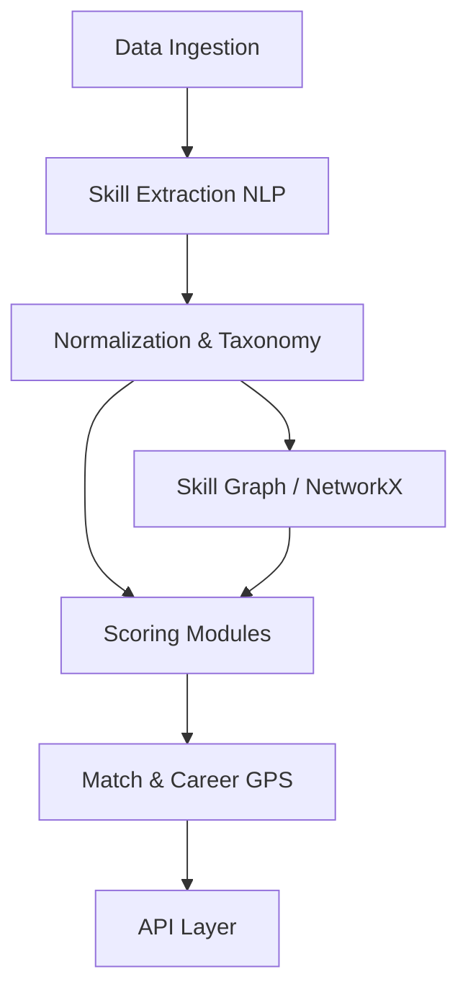

# Architecture

SkillSetu X is built as a robust intelligence engine with NLP pipelines, ML scoring modules, and graph algorithms.

## System Overview

## Core Components
- **Taxonomy Engine**: Normalizes ESCO + O*NET data.
- **Scoring Modules**: Calculates STS, SHI, CDS, SOE deterministically.
- **Skill Graph**: Manages prerequisite and co-occurrence graphs using NetworkX.
