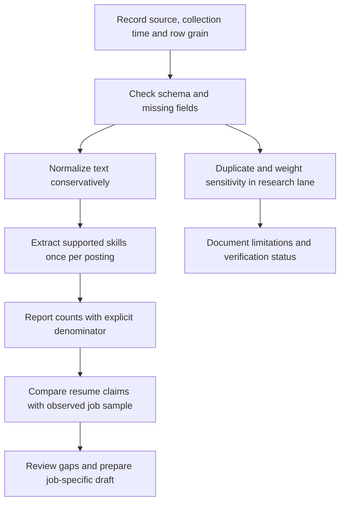

# Data evidence, mathematics and interpretation

Reviewed 8 October 2026. This record explains observed data, calculations, issues and what the product actually uses. Public feed receipts are in `docs/evidence`; challenge raw rows and applicant documents are not published here.

## Evidence lanes

| Lane | Evidence | Status | Permitted interpretation |
| --- | --- | --- | --- |
| Live employer feed | [Greenhouse receipt](../evidence/greenhouse-live-check.json) | HTTP 200, 426 public postings, collected 2026-10-07T21:10:12.657494+00:00 UTC | Selected employer-board sample at collection time |
| Live Apify discovery | [Apify run receipt](../evidence/apify-live-check.json) | SUCCEEDED, 10 rows, 10 distinct listing URLs | Query-specific discovery; no employer applications |
| Hackathon aggregate demonstration | [Recorded aggregate artifact](../../sas-hackathon/evidence/reproduced_source_metrics.json) | Locally reproduced; VFL verification pending | Dated sample analysis, not a live vacancy feed |
| Screenshot demand example | [Skill-demand screen](../assets/screenshots/resume-skill-demand.png) | Synthetic test resume and ten-listing fixture | Demonstration of UI calculations; not a market estimate |
| Browser application evidence | [Controlled form tests](../../tests/api/test_browser_submission.py) | Successful confirmation and uncertain-outcome paths tested | Mechanism verification, not all-employer compatibility |

The Greenhouse check is a fresh read-only request. Its receipt records the source URL, timestamp, response hash and quality counts. It is separate from account imports; 426 returned feed records does not mean every account imported 426 jobs.

## Live sample: skills mentioned by the employer board

| Skill | Mentioning postings | Denominator | Mention share |
| --- | ---: | ---: | ---: |
| Communication | 301 | 426 | 70.66% |
| Networking | 183 | 426 | 42.96% |
| Python | 106 | 426 | 24.88% |
| JavaScript | 94 | 426 | 22.07% |
| TypeScript | 57 | 426 | 13.38% |
| Cybersecurity | 46 | 426 | 10.8% |
| Kubernetes | 46 | 426 | 10.8% |
| Linux | 40 | 426 | 9.39% |
| SQL | 37 | 426 | 8.69% |
| AWS | 34 | 426 | 7.98% |
| Testing | 32 | 426 | 7.51% |
| Machine Learning | 27 | 426 | 6.34% |

For example, Python is mentioned by 106 of 426 sampled postings: `106 / 426 × 100 = 24.88%`. This is the mention share across this board's returned roles, not a demand probability, skill proficiency score or hiring success rate. A role-filtered sample can produce a different rate. The public receipt also records zero missing titles, zero missing descriptions, zero missing original URLs and zero repeated job IDs in that particular response. Those checks do not establish semantic uniqueness or complete requirements.

Apify's test query was **Python Developer / Berlin, Germany**. Returned posting dates ranged from **2025-01-20 to 2026-10-07**. Retrieval date and publication date differ: an older listing appearing in search must not be described as newly posted. This test proves feed connectivity; it does not show that senior Berlin roles are suitable for this applicant.

## Recorded challenge data: observed issues

| Issue | Count / source rows | Share |
| --- | ---: | ---: |
| Analytics job descriptions missing | 3,508/15,841 | 22.15% |
| Analytics job type missing | 12,011/15,841 | 75.82% |
| Skill fields containing ellipsis | 13,806/15,841 | 87.15% |
| Excess repeated DataScience references | 142/1,602 | 8.86% |

Analytics Jobs has **15,841 rows**; its skill-text denominator is **15,840**, because one key-skills field is missing. Missing job descriptions and heavily abbreviated skill text limit what exact-token extraction can recover. Missing job type cannot be filled from a general assumption. Preserve raw labels and document any `analytic` / `analytics` normalization separately.

DataScience Jobs has **1,602 rows**, **1,460 distinct references**, and **142 excess repeated-reference rows**. Repeated references require a sensitivity analysis: do not silently treat each repeated row as a unique vacancy or remove it without documenting the effect.

The supplied `num_of_jobs` weights sum to **93,005**, with median **22.0** and maximum **4,200**. The maximum alone contributes `4200 / 93005 × 100 = 4.52%` of the supplied sum. The sum is an unverified weight proxy, not a count of confirmed live openings. Compare unweighted, capped and leave-largest-out results before interpreting rankings.

## Formulas and how the app uses them

1. **One posting, one mention per skill:** `I(job, skill) = 1` when the supported extraction identifies a skill; otherwise `0`. Repeated mentions in one posting do not increase its count.
2. **Live mention count:** `count(skill) = sum I(job, skill)` across active, non-demo imported postings.
3. **Live mention share:** `share(skill) = 100 × count(skill) / active_postings`. The Vault shows this percentage and its numerator/denominator.
4. **Missing from a resume:** `missing = supported skills in job sample − extracted skills in the selected document`. Absence from extraction is not proof of missing ability. The text box sorts by observed mentioning-posting count.
5. **Historical change:** `delta(skill) = current count − previous comparable count`. The API withholds a change when board/source sets or refresh completion are not comparable. Its current live endpoint compares saved snapshots; it does not predict tomorrow's jobs.
6. **Recorded exact-token share:** `rate(skill) = mentioning rows / rows with usable skill text`. SQL in the challenge snapshot is `915 / 15840 = 5.78%`, Python `840 / 15840 = 5.30%`, SAS `636 / 15840 = 4.02%`. These use the recorded exact-token method, which differs from the live taxonomy extractor.
7. **Missingness:** `missing share = missing values / source rows × 100`. Report each field with its own source denominator.
8. **Excess repeats:** `excess reference rows = total rows − distinct references`; here `1602 − 1460 = 142`. This is a reference diagnostic, not a verified duplicate-vacancy count.
9. **Weighted share:** `sum(weight × indicator) / sum(weight)`. Only use valid documented weights and label results as supplied-weighted. This is a research scenario, not the live dashboard calculation.

Research formulas for co-mentions, Jaccard similarity, standardized differences and grouped evaluation are documented in [deep processing](../../sas-hackathon/docs/deep-data-processing.md). They are not all implemented product indicators. The recorded JDS/SDS trait associations are unadjusted sample statistics; they are not causal effects or individual suitability predictions. JDS and SDS remain independent lanes.

## Approach and interpretation boundaries

No challenge/person records are joined into live applications. Hybrid shows separate live and recorded views; it does not pool their denominators. The dashboard's trends need comparable observed history. No trained-model accuracy, causal claim, national labor-market estimate or forecast has been validated for this delivery.

## What is actually verified

- Production website build passed; 58 backend tests and 11 full browser journeys passed.
- A separate demand-display browser test verifies 40%, 4/10, +2 and the SQL missing-skills box against controlled data.
- Apify returned ten jobs, the saved Gemini connection produced a role-specific draft, and Greenhouse responded successfully to the public feed check.
- Real employer submission, working LinkedIn delivery, VFL execution and model evaluation remain separate evidence requirements. The saved Publora key was rejected on the last check.

See [delivery status](../verification/local-delivery.md), [source register](../data-sources.md) and [research sources](../hackathon-research/sources.csv).
