# Limit.less — product presentation

[← Back to README](../../README.md) · [Interactive slideshow source](demo-presentation.html) · [Screenshot gallery](screenshot-gallery.md)

This presentation renders directly on GitHub. For automatic playback and keyboard navigation, download the repository, extract it, and open `docs/showcase/demo-presentation.html` in a browser. Screenshots use test accounts; captions identify demonstration data and captured live-feed evidence.

---

## 01 · Limit.less

Local delivery · 8 October 2026

From a résumé to skill insights, matched jobs, a tailored application and traceable submission outcomes.

A working walkthrough with explicit live-service limits.

---

## 02 · 1. Upload and understand

PDF, DOCX and text résumés produce visible skill claims. DOCX table content is included. Upload results show next actions for résumé review, skill demand and matching.

Claims are not certifications. Scanned documents need readable text.

---

## 03 · 2. Discover real opportunities

Greenhouse and Lever imports, Apify LinkedIn discovery and optional Adzuna India search feed per-account matching.

Verified Apify run: 10 Python Developer listings in Berlin. Posting dates are preserved; the connection test does not establish applicant suitability.

---

## 04 · 3. Tailor each résumé

Gemini or OpenAI writes a separate draft from source facts and the selected job. An actual draft was generated using the saved Gemini connection.

The applicant reviews the draft before submission. Invented experience is not permitted.

---

## 05 · 4. Apply and track evidence

The local Gemini browser worker fills supported employer forms and uploads a PDF. It records submission only after a new employer confirmation.

Missing answers, login and CAPTCHA stop for attention. An uncertain post-submit result is recorded without blind retry.

Controlled form submission tests passed. A real-employer submission has not been used as a test.

---

## 06 · 5. Three data choices in Settings

Live shows imported job observations. Hackathon shows a recorded aggregate demonstration. Hybrid displays both with separate labels.

Demo applications never contact employers.

---

## 07 · 6. Social Studio and SAS

LinkedIn drafts, reviewed scheduling and provider delivery checks are implemented. The saved Publora key must pass authentication before live publishing can be verified.

SAS workspace launch and analysis navigation are integrated. VFL execution and verified sync await a real workspace session.

---

## 08 · 7. Evidence and remaining work

Production build and API checks pass. Browser journeys verify resume upload, demonstration applications, navigation, assessments and source settings.

Remaining external dependencies: website Apify token, accepted Publora credentials, SAS session, and suitable real-employer verification. Government automated vacancy discovery and broader internship coverage remain incomplete.

[Delivery status and source references](../verification/local-delivery.md)

---

## 09 · Landing page — desktop

Captured interface · 1

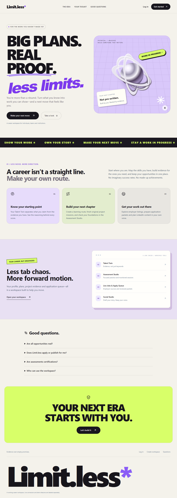

The current Limit.less landing and product introduction.

---

## 10 · Landing page — mobile

Captured interface · 2

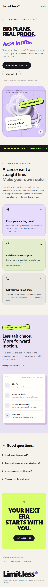

Responsive landing layout captured in the browser.

---

## 11 · Main dashboard

Captured interface · 3

Career overview for a fresh test account.

---

## 12 · Resume upload and extracted skills

Captured interface · 4

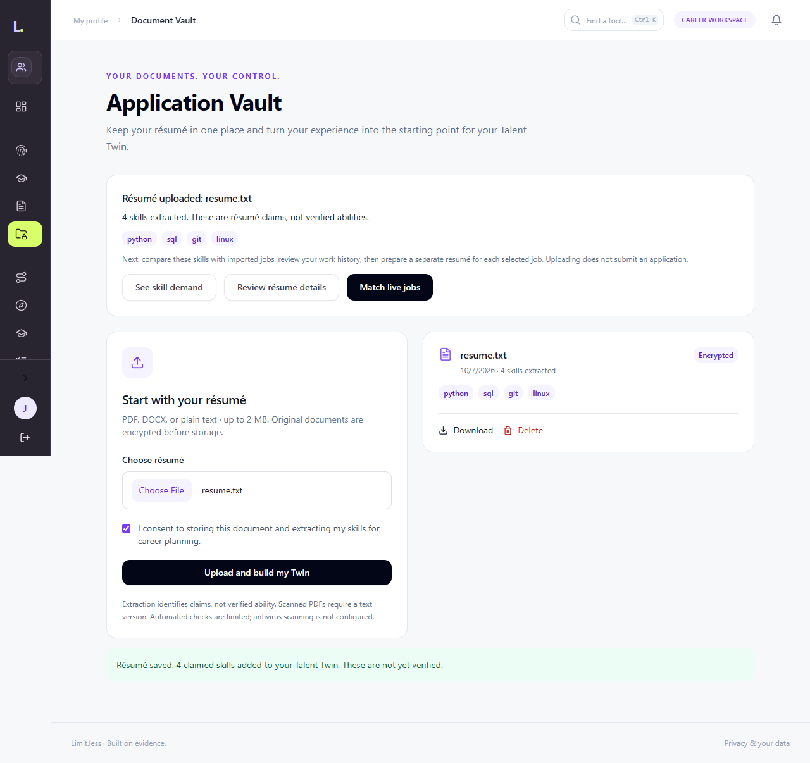

Document upload result, extracted claims and next actions.

---

## 13 · Skill demand and missing skills

Captured interface · 5

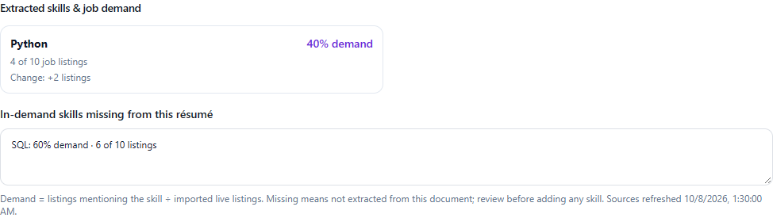

Actual UI with synthetic test data: Python demand 40%, four of ten listings, change +2; SQL demand 60%, missing from this sample resume.

---

## 14 · Hackathon analysis view

Captured interface · 6

Recorded aggregate sample, processing stages and demo navigation. VFL verification remains pending.

---

## 15 · Application tracker — desktop

Captured interface · 7

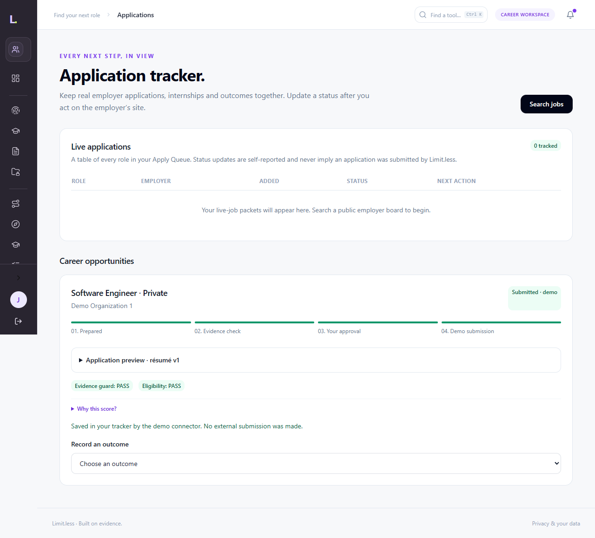

Explicitly labelled demo submission; no employer contact.

---

## 16 · Application tracker — mobile

Captured interface · 8

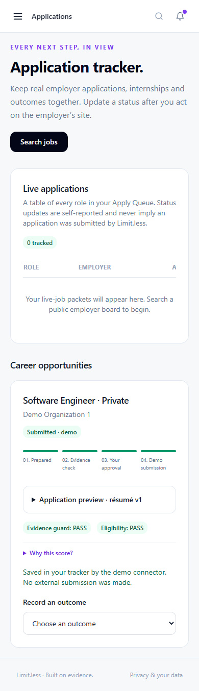

The demo journey on a mobile viewport.

---

## 17 · Assessment Studio

Captured interface · 9

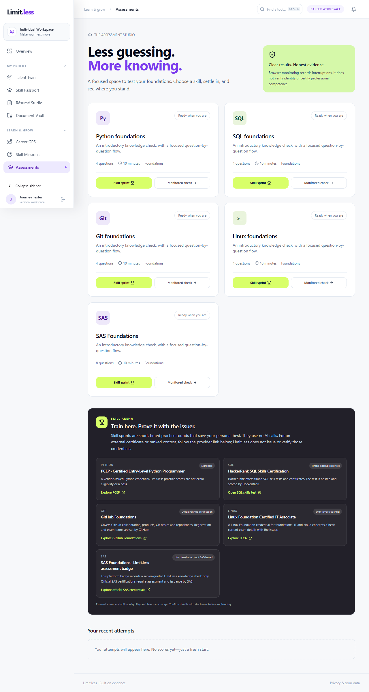

Practice and monitored-attempt choices.

---

## 18 · Assessment attempt

Captured interface · 10

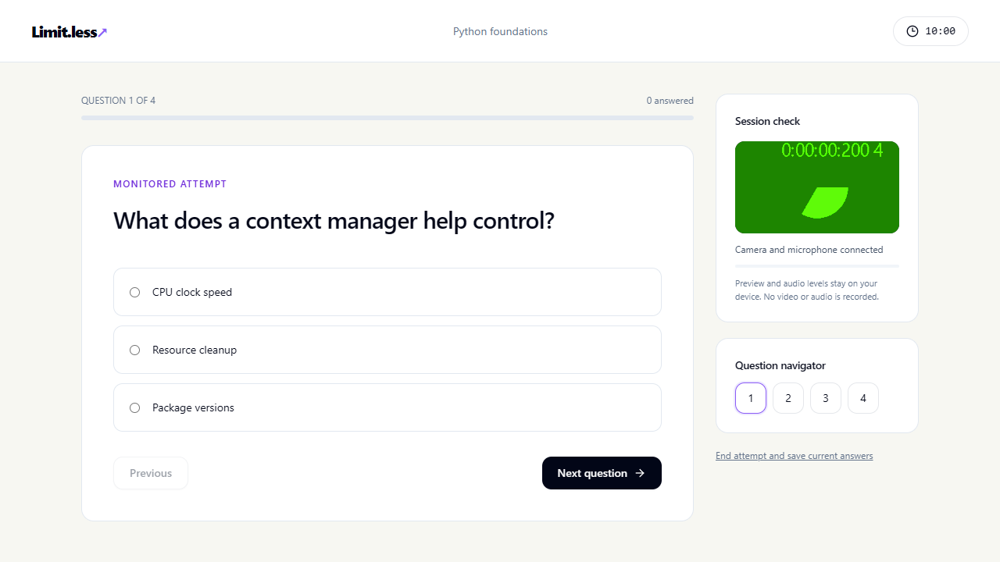

Captured assessment interface; monitoring is not certification.

---

## 19 · Workforce analysis

Captured interface · 11

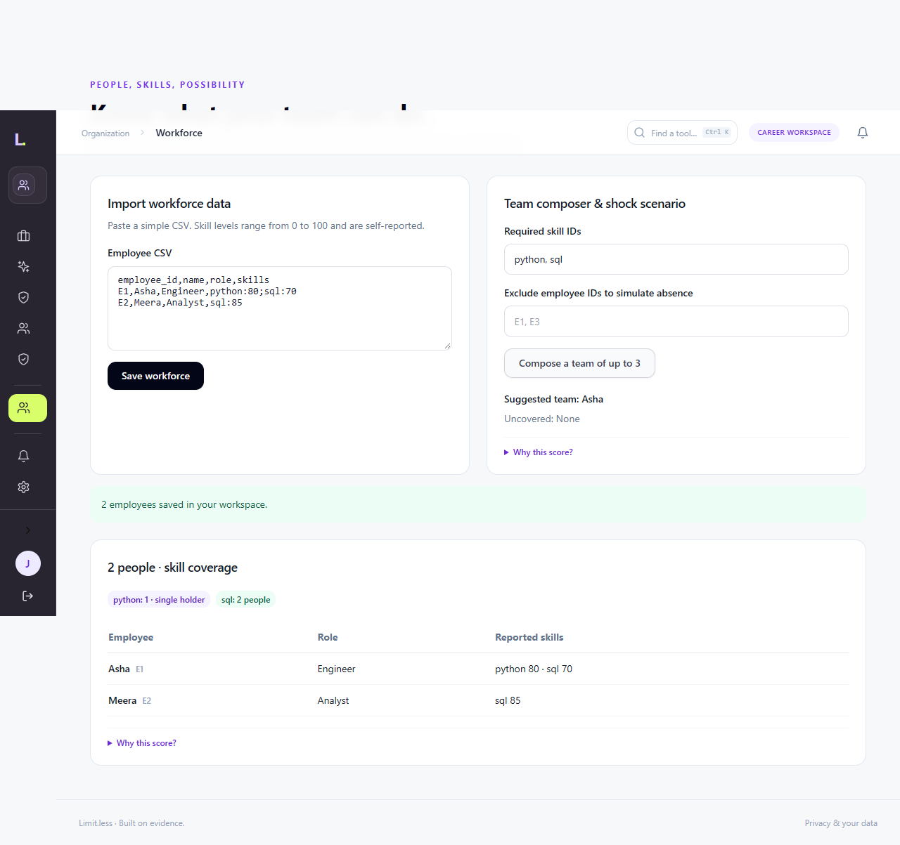

Organization workspace import and analysis demonstration.

---

## 20 · Curriculum comparison

Captured interface · 12

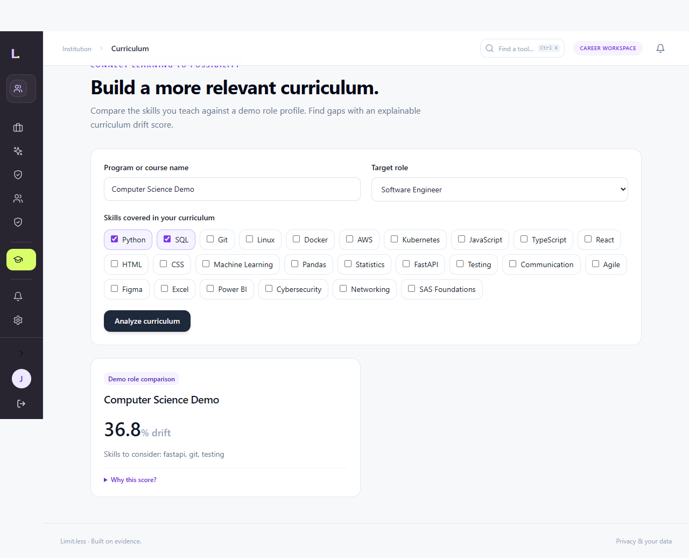

Institution workspace curriculum and gap analysis.

---

## 21 · Compact navigation

Captured interface · 13

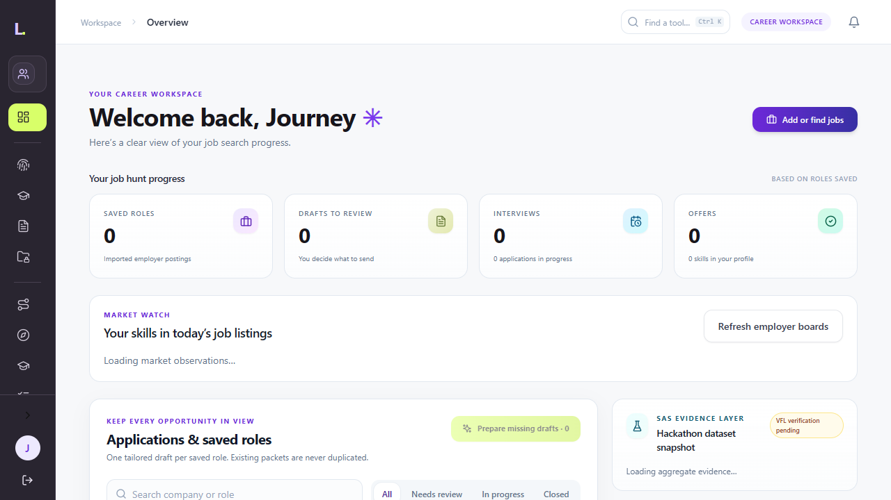

Tool rail and remembered navigation preferences.

---

## 22 · Expanded navigation

Captured interface · 14

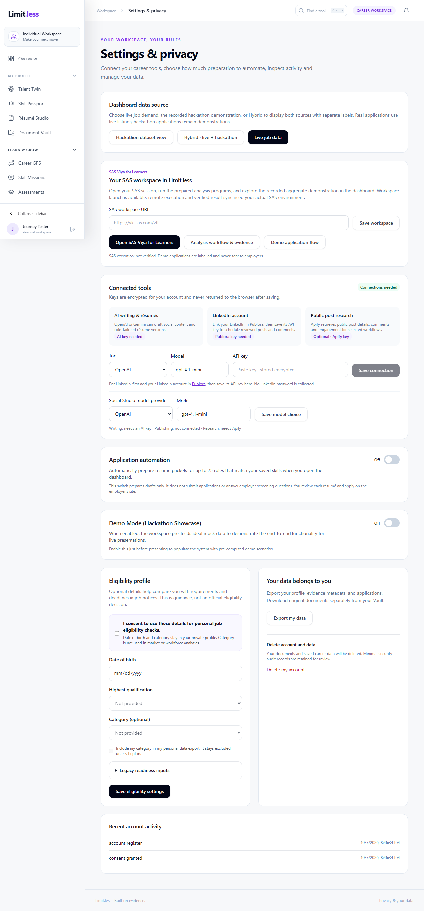

Categorized workspace navigation.

---

## 23 · Mobile navigation

Captured interface · 15

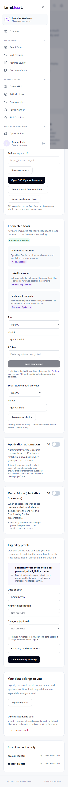

Accessible mobile menu captured during browser verification.

---

## 24 · Sidebar rail

Captured interface · 16

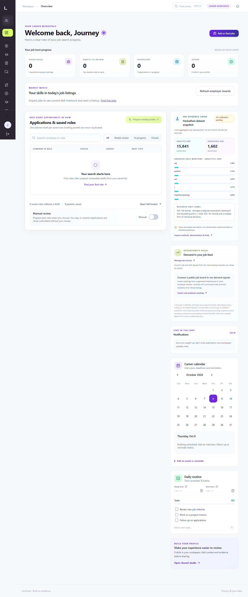

Compact sidebar state from the actual interface.

---

## 25 · Live feed evidence

Greenhouse returned 426 public employer postings with HTTP 200. The receipt contains the source URL, collection timestamp and response hash.

Python: 106 / 426 × 100 = 24.88%. This is a selected-board mention share.

Apify discovery returned 10 listings; collection time is different from their posting dates.

[Explore source counts interactively](../research/data-explorer.html)

---

## 26 · Dataset issues and interpretation

Analytics Jobs: 15,841 rows; 3,508 missing job descriptions; 12,011 missing job types; 13,806 skill fields with ellipsis.

DataScience Jobs: 1,602 rows, 1,460 distinct references, 142 excess reference rows. The supplied weight sum 93,005 is not verified vacancies.

[Read formulas, quality checks and interpretation](../research/data-evidence.md)

---

## 27 · Evidence charts

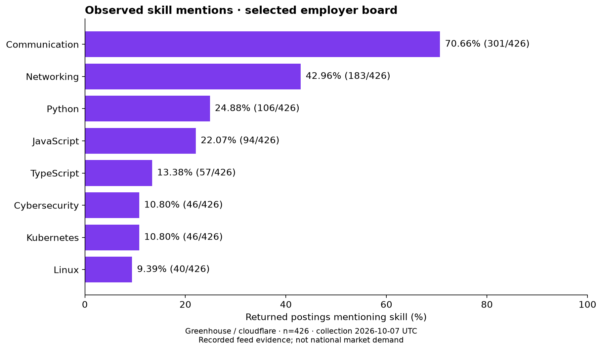

Counts retain the 426-posting denominator. No market forecast or hiring probability is implied.

---

## 28 · Data quality

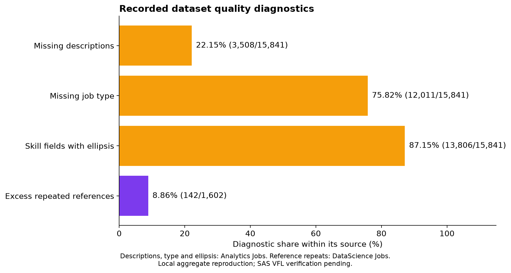

Each diagnostic uses its own source denominator.
