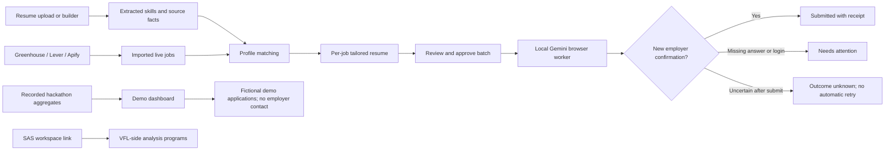
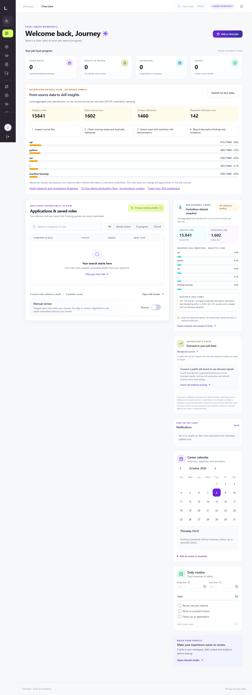

# Verified local delivery — 8 October 2026

## What was checked

- Next.js production build: all 40 routes compiled, type and lint checks passed.
- Complete Python suite: 113 tests passed. Backend API suite: 58 tests passed, including DOCX table extraction, Apify/SAS integration, provider errors and controlled browser submission.
- Browser journeys: all 11 passed in one full run, including resume upload, source choices, Hybrid, SAS launch, demo separation and mobile navigation.
- Real Apify OAuth authorization succeeded. Actor `PeTP8M7vkdTthJvqk` was verified as `crawlworks/linkedin-jobs-scraper`.
- Live Python Developer / Berlin search succeeded: run `dGNmlaOZmOKq7T0Mk`, dataset `WNCMNfE4CQ9eETqUJ`, ten jobs. These were imported into the existing local account. This is a connection test, not a claim that Berlin senior jobs suit the applicant.
- A saved Gemini connection generated an actual role-tailored résumé from the account's existing source. The packet remains for review. No real employer submission or public LinkedIn post was used as a test.
- Controlled browser tests exercise form filling, PDF upload, final submission and receipt detection. A form without confirmation becomes `outcome_unknown`, preventing blind retries.

## Main flow

## What remains

1. **Website Apify credentials:** Codex MCP OAuth is connected, but the website's server uses its own encrypted per-account Apify API token. Save that token in Settings to enable ongoing searches and dataset imports directly from the website. Do not paste it into chat. The verified ten-job dataset is already imported.
2. **LinkedIn publishing:** the saved Publora key returned a provider authentication rejection. Replace it and connect a LinkedIn channel in Publora. Reviewed scheduling is implemented; actual account delivery is not verified yet. Provider authentication failures no longer log the user out of Limit.less. Manage dispatched posts in Publora; deleting a local draft cannot cancel a provider delivery.
3. **SAS VFL:** workspace launch and analysis navigation are integrated. A valid workspace URL and available VFL session are needed to run the SAS programs. Current aggregate evidence is explicitly a locally reproduced snapshot; VFL verification remains pending. No execution or model evaluation results are invented.
4. **Real application verification:** the worker is enabled locally, uses the saved Gemini key, and stops when the form needs facts it does not have. Select suitable jobs and approve the batch in Auto-Apply. LinkedIn sign-in/Easy Apply and CAPTCHA may require manual completion. Controlled form tests do not prove every employer form works.
5. **Hosting:** this delivery runs locally. Hosted environment configuration is prepared, but no production hosting link or deployment has been verified.
   **Government jobs and internships:** internship classification and filters exist for imported employer boards and Apify jobs. Comprehensive internship source coverage is unverified. The automatic government vacancy connector is currently disabled; government/PSU source import, official notice dates and vacancy refresh still need implementation and verification. Adzuna India search needs valid provider credentials.
6. **Documentation:** the current screenshot gallery, walkthrough presentation, diagrams and research links are complete for this local delivery. Broader employer compatibility evaluation and further folder consolidation remain pending; existing user work and separately licensed integrations were preserved.

## Main folders

| Folder | Role |
| --- | --- |
| `apps/api/app/runtime` | Active account, resume, job, application, social and SAS APIs |
| `apps/web/src/components/journey` | Working product screens |
| `packages/scoring` | Skill extraction, matching and eligibility logic |
| `tests/api`, `apps/web/e2e` | API and browser verification |
| `sas-hackathon/sas` | VFL analysis programs |
| `sas-hackathon/docs`, `docs/hackathon-research` | Runbook, processing method and source register |
| `.local` | Private local database, installed runtime dependencies and development artifacts; ignored by Git |

## Actual browser screenshot

The screenshot uses a test account and recorded aggregate demo data.

Research: [methodology](../hackathon-research/2026-10-07_methodology.md), [source register](../hackathon-research/sources.csv), [processing guide](../../sas-hackathon/docs/deep-data-processing.md), [SAS runbook](../../sas-hackathon/docs/vfl-runbook.md).

[Screenshot gallery](../showcase/screenshot-gallery.md) · [Presentation walkthrough](../showcase/demo-presentation.html)

Résumé upload now displays the filename, extracted skills, unverified-claim status and next actions. DOCX tables and nested tables are included. The Social Studio delivery check uses the provider's real get-post response; a missing receipt cannot claim publication. Rechecked saved Publora credentials still returned HTTP 401; Gemini and Greenhouse both returned HTTP 200.

Settings now offers three dashboard source choices: Hackathon dataset view, Hybrid (both separately labelled), and Live job data. The choice controls presentation only; recorded challenge aggregates cannot enter the live submission worker.

