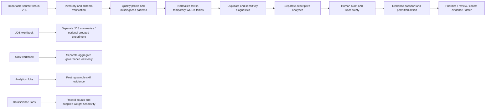

# Limit.less — deep data processing plan

This is the operational specification for the SAS challenge analysis. The four supplied files are analyzed as **four independent evidence lanes** inside the organizer-approved SAS Viya for Learners (VFL) workspace. Local code describes the work; no challenge rows, row-level derived features, identifiers, or computed results belong in the hosted Limit.less app or this repository unless the organizer gives written approval.

## Processing map

The graph indicates workflow only. It does not imply that rows from different files are joined. JDS may only be compared to market findings through an explicitly reviewed aggregate concept crosswalk. SDS never enters an individual score, recommendation, hiring, screening, or promotion flow.

## Stages and outputs

| Stage | Processing | Aggregate evidence retained in VFL | Gate / stop condition |
|---|---|---|---|
| 0. Source receipt | Record source filename, table, sheet, receipt date, row grain, code version, run ID, and permitted location. Preserve the imported source. | Source inventory and metadata. | Stop if event permission, source release, or table identity is unclear. |
| 1. Schema and coverage | Confirm fields and SAS types; count rows, missing values, blank strings, and field-specific coverage. | `SB_FIELD_PROFILE`; schema inventory. | Never interpret “not mentioned” as “not required” when the field is blank. |
| 2. Conservative preparation | Normalize case and repeated whitespace; remove HTML tags from descriptions; preserve separate skill-list and description fields. Create a run-local row ordinal and MD5 fingerprint inside `WORK` only. | Missingness-pattern counts and exact-normalized-duplicate sensitivity. | Do not overwrite originals, drop rows, or treat the ordinal/fingerprint as a real job/person identifier. |
| 3. Text signal extraction | Apply a versioned, explicit phrase dictionary separately to each text field; each canonical phrase counts at most once per row. | Skill counts with source-row and usable-text denominators; co-mentions and Jaccard. | Low support, ambiguous mapping, or inadequate text coverage means REVIEW/NOT RUN, not a market claim. |
| 4. Duplicate sensitivity | Compare raw record counts with exact normalized-text unique counts. Recompute skill counts after exact-duplicate suppression as a sensitivity view; do not silently deduplicate. | Duplicate groups, excess rows, and before/after counts. | Exact text match is not proof of a duplicate vacancy; distinct text is not proof of distinct vacancy. No ghost-job claim. |
| 5. DataScience weight audit | Parse `num_of_jobs` defensively; report missing, invalid, negative, quantiles, maximum, title-level record counts and separate weight sums. Compare unweighted, supplied-weighted, capped-weight, and leave-one-maximum-out views. | Row-based results and each weighted scenario side by side. | `num_of_jobs` remains an unverified supplied proxy, not verified unique openings. Never hide influential weights. |
| 6. JDS analysis | Confirm exact trait fields, label meanings, scales, missingness, repeated-ID semantics and allowed use. Start with class prevalence and aggregate trait descriptions. Optional grouped out-of-fold logistic experiment only after these checks. | Label counts, coverage, class-specific summaries; if approved, grouped-fold baseline/model metrics. | No row-level individual prediction, causal language, or external data join. If IDs/labels are unclear, stop model stage. |
| 7. SDS governance view | Independently verify SDS variables and labels; report only approved, sufficiently aggregated descriptive summaries. | Separate SDS aggregate summary and disclosure check. | Never use SDS for person-level employment/career decisions or combine it with JDS/job data. |
| 8. Human audit | Review a stratified sample of frequent, ambiguous and long-tail phrase matches, including text-field and role strata. Freeze reviewer labels before tuning. | Confusion matrix, precision/recall/F1, coverage, abstention, reviewer agreement and intervals. | Do not call dictionary extraction “validated” before independent labels exist. |
| 9. Evidence passport | Attach source, unit, denominator, formula, mapping version, quality, validation, sensitivity, uncertainty, boundary and reviewer to each headline. | Claim-level evidence ledger. | Any undocumented field, fragile mapping, small/unstable denominator, or missing approval is WARN/BLOCKED/NOT RUN. |

## Mathematical definitions

For a market source with (N) rows and a text field (f), let (T_f) be the rows whose normalized field is non-empty. For canonical skill (s), let (I_{is}=1) when the approved phrase rule finds (s) in row (i), and (0) otherwise. The count and conditional mention rate are

\[
C_{s,f}=\sum_{i\in T_f} I_{is},\qquad
\hat p_{s,f}=\frac{C_{s,f}}{|T_f|}.
\]

Always show (C_{s,f}), (|T_f|), and the source row count together. This is a phrase-mention rate within the supplied sample, not the probability that an employer requires a skill. For the skill pair (a,b), support is (C_{ab,f}=\sum I_{ia}I_{ib}), and Jaccard is

\[
J_{ab,f}=\frac{C_{ab,f}}{C_{a,f}+C_{b,f}-C_{ab,f}}.
\]

The candidate graph uses co-mentions only; an edge does not mean prerequisite, causation, or semantic equivalence.

For DataScience Jobs rows (i=1,\ldots,n) with supplied weights (w_i=\texttt{num\_of\_jobs}), the row count (n) and weight sum

\[
W=\sum_{i=1}^{n} w_i
\]

are reported as different units. Invalid/missing weights are counted and excluded from (W), not silently set to zero. Show each title’s record count and weight sum, the weight distribution, concentration, and sensitivity under (w_i^{(c)}=\min(w_i,c)) for declared cap (c), plus (W_{-\max}=W-\max_i(w_i)). Without a source definition for the weight and a representative sampling design, (W) is not a national vacancy estimate.

For any finding selected for stability analysis, compare predeclared choices (base dictionary, reviewed alias set, exact-duplicate sensitivity, row vs supplied-weight view, and eligible text-field denominator). Report the rank/order or rate range across those choices; do not average the variants into a decorative confidence score. For estimates intended beyond a finite file, use an appropriate interval and state the sampling limitation; a confidence interval cannot repair selection bias or a convenience sample.

For an independently labeled phrase audit, with true positives (TP), false positives (FP), and false negatives (FN):

\[
\text{Precision}=\frac{TP}{TP+FP},\quad
\text{Recall}=\frac{TP}{TP+FN},\quad
F_1=2\frac{\text{Precision}\cdot\text{Recall}}{\text{Precision}+\text{Recall}}.
\]

Also report the labeled sample size, strata, reviewer agreement, and an uncertainty interval. The audit measures this extraction protocol on the reviewed sample; it does not prove broad labor-market validity.

For JDS only, let \(Y_i\in\{0,1\}\) be the verified supplied high/low label and \(X_i=(x_{i1},\ldots,x_{i5})\) the five confirmed numeric skill dimensions. The exploratory logistic model is

\[
\Pr(Y_i=1\mid X_i)=\sigma\!\left(\beta_0+\sum_{k=1}^{5}\beta_kx_{ik}\right),\qquad
\sigma(u)=\frac{1}{1+e^{-u}}.
\]

The coefficients describe conditional associations in JDS; they are not causal effects. If a repeated-person ID is confirmed, assign every row for an ID to exactly one fold. For fold \(k\), train on all other ID groups and score only the held-out groups. The baseline probability for a held-out case is the positive-label prevalence in that fold’s training partition, \(\hat\pi_{-k}=n_{1,-k}/n_{-k}\). No held-out label is used to fit that fold’s model or baseline.

The pooled out-of-fold metrics are:

\[
\operatorname{Brier}=\frac{1}{N}\sum_{i=1}^{N}(y_i-\hat p_i)^2,
\qquad
\operatorname{Accuracy}_{0.5}=\frac{1}{N}\sum_{i=1}^{N}\mathbf 1[\mathbf 1(\hat p_i\geq0.5)=y_i],
\]

and AUC is the probability that a randomly chosen positive receives a higher score than a randomly chosen negative, with half credit for ties. Compare the model’s Brier score and threshold accuracy with the out-of-fold prevalence baseline; AUC alone is not enough. Report complete-case coverage \(N_{complete}/N_{mapped}\), class counts, and fold diagnostics beside the metrics. The current SAS program applies a fixed 20-complete-row engineering stop rule and requires both classes in every train/test partition; this is a fail-safe, **not** a scientifically established sample-size adequacy threshold. The model is not run if any required mapping, label interpretation, ID semantics, class/fold check, or organizer approval is missing. It remains an exploratory within-JDS experiment even if it runs.

For a skill-family training investigation, do not compress all evidence dimensions into a single score. Keep a vector such as

\[
E_s=(C_s,\ |T_f|,\ q_s,\ r_s,\ v_s,\ d_s),
\]

where \(C_s\) is the count, \(|T_f|\) is the eligible denominator, \(q_s\) is the extraction-audit result, \(r_s\) is scenario/rank stability, \(v_s\) is text coverage, and \(d_s\) is duplicate/weight sensitivity. A predeclared release rule can require each dimension to pass its own review threshold. Threshold values must be agreed before results are inspected; if no justified threshold exists, the action is “review,” “collect evidence,” or “defer,” not a fabricated 98/100 recommendation score.

## What “deep” means in this project

Depth means auditing the data-generating and measurement process, not adding a complex model by default. The core work is: verify schema and units; quantify missingness and text availability; normalize reproducibly; inspect duplicates and influential observations; keep denominators honest; test mapping quality with human labels; compare reasonable assumptions; keep the trait work isolated; and make every result traceable to its source and formula. A more complex model is only justified after sample size, labels, grouping, and an evaluation design support it.

## Current execution status

The VFL programs now include source preflight, field profiles, conservative Analytics Jobs preparation, market phrase summaries, separate DataScience weight summaries, separated JDS/SDS summaries, an optional JDS-only grouped experiment, and closeout gates. `15_deep_data_prep.sas` is new and is designed to produce a temporary prepared Analytics table plus aggregate missingness and exact-text duplicate diagnostics. It has **not been executed in VFL**. No VFL credentials, source rows, or computed challenge results are used in local tests. A VFL run and organizer-approved review are still required before reporting empirical findings.
