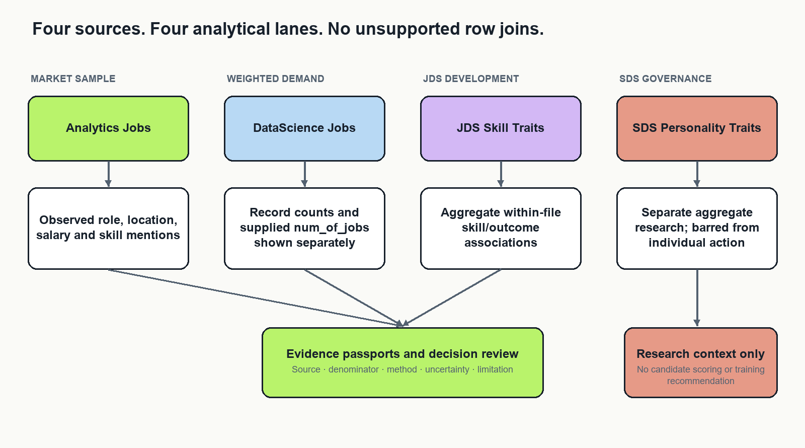
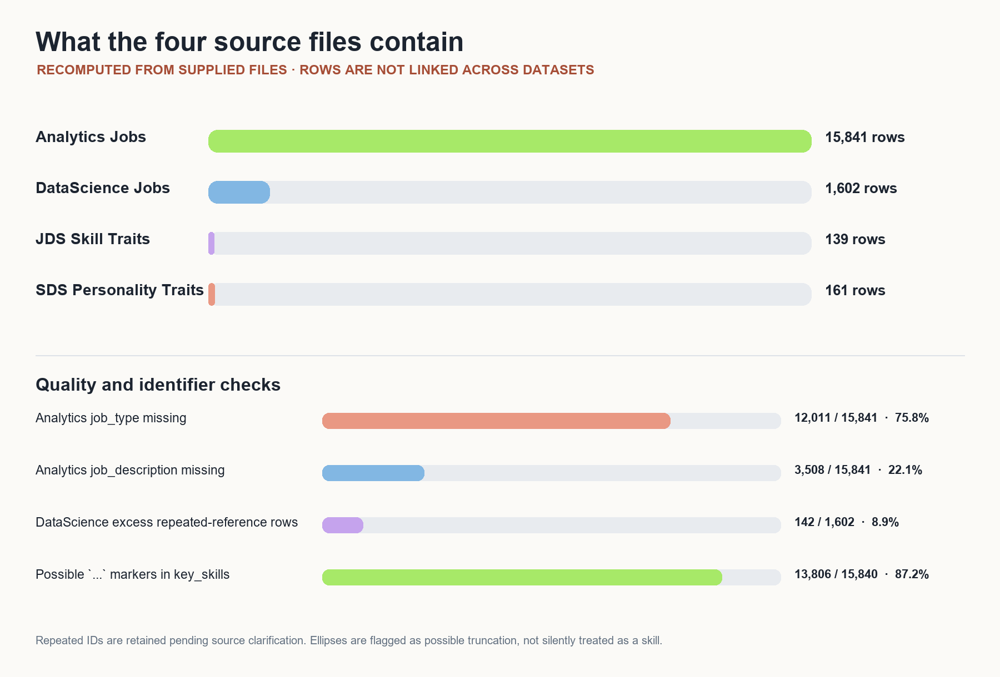
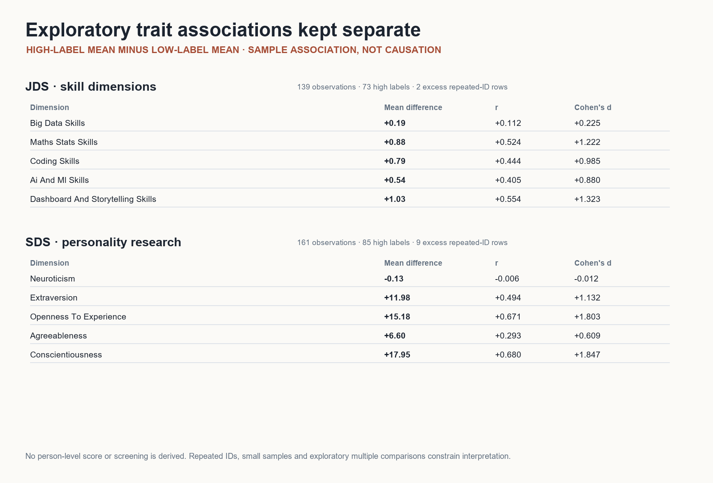
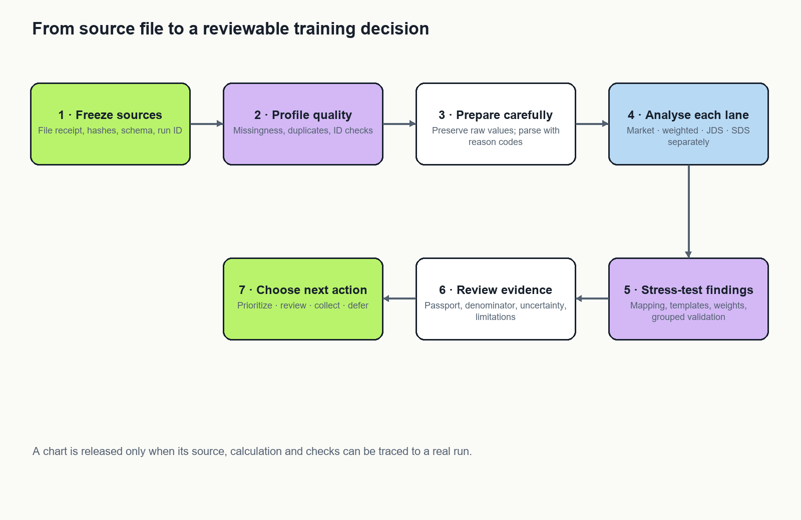
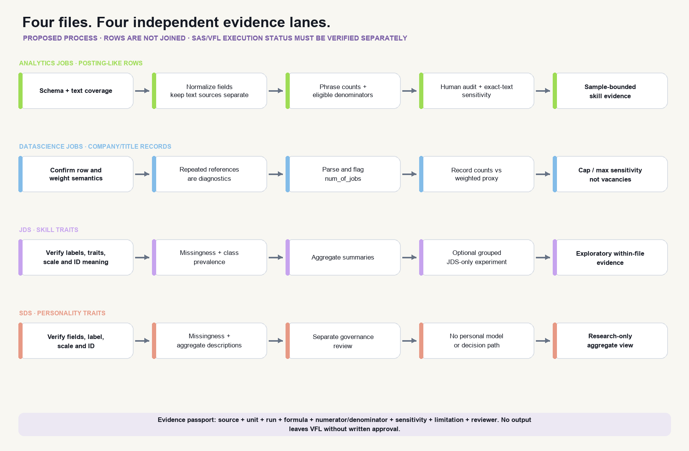
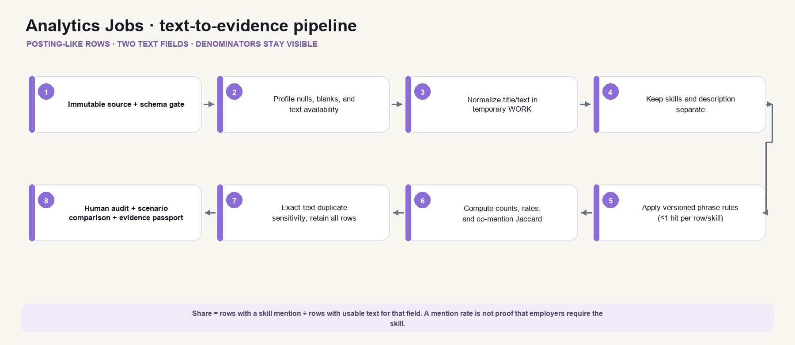
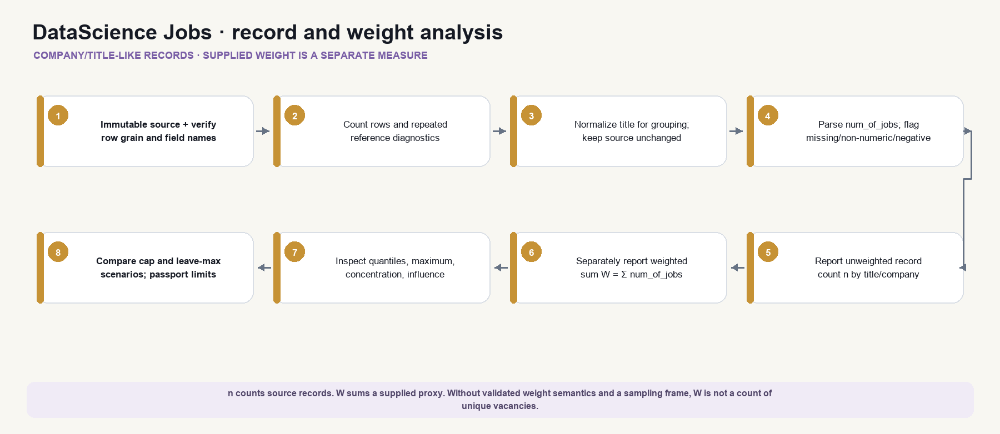
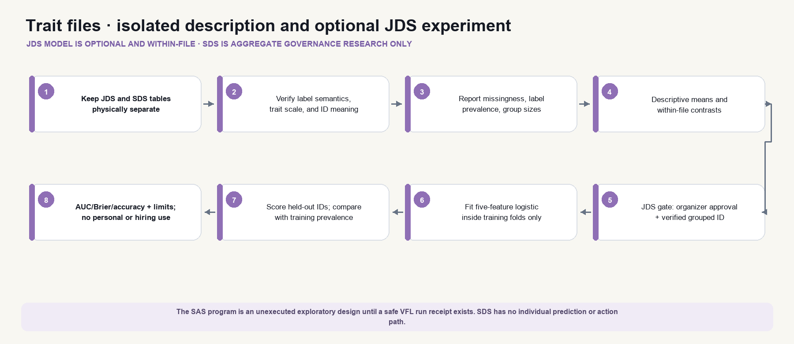
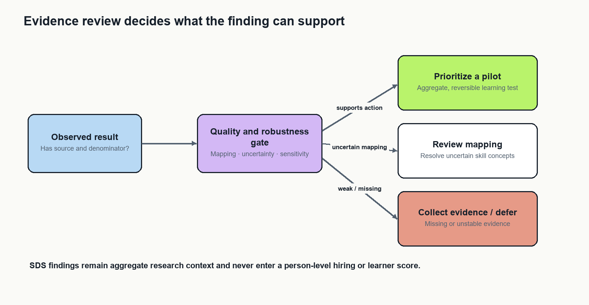

# Limit.less Round 2 Dataset Analysis and Evidence Report

**SAS Data Analytics Hackathon · Round 2 research and build plan**  
**Team:** Pookie Blinders · **Team ID:** 117  
**Project:** Limit.less  
**Prepared:** 7 October 2026

## Purpose and decision

Limit.less will be developed as a dataset-analysis project for evidence-informed data-career training decisions. Its primary deliverable is a reproducible analysis and a clear Round 2 approach note. An evidence interface will help evaluators inspect the findings, methods and limitations. The existing career-platform features are outside this project's core scope.

The recommended research question is: **Which skill and role patterns in the supplied job samples are sufficiently stable to inform a training investigation, and what separate development hypotheses emerge from the supplied skill and personality samples?**

The distinctive contribution is a robustness-first decision workflow. We will measure how conclusions change when defensible preparation and measurement choices change, rather than presenting a single attractive ranking as settled truth. This is an engineering and analytical contribution; it is not a claim to have invented a new statistical method.

This report presents the project decision, analysis of the four supplied files, the calculations used to interpret them, and the evidence limits that govern recommendations. Descriptive counts and associations below were recomputed from the supplied source files for this report. The earlier reported model metrics are kept separate because their run configuration and execution receipt were not available for independent reproduction. Research sources were reviewed on 7 October 2026.

## 1 Problem definition and stakeholders

### 1.1 The decision being supported

A university placement or training team has limited teaching time. It needs to identify worthwhile areas for data-career learning, understand which role families request them, and explain its choices. A raw frequency chart is insufficient: repeated advertisement templates, missing descriptions, ambiguous skill names and supplied job-count weights can change the ranking. Small internal trait datasets introduce further uncertainty and describe different populations.

The project supports a decision about **which aggregate training topics to investigate or pilot**. It does not decide who should be hired, promoted or rejected. The primary stakeholder is a placement or curriculum team. Learners are secondary beneficiaries of clearer, reviewable learning priorities. Researchers use the separate trait views to examine associations and measurement limitations.

### 1.2 Research questions

RQ1: What observed skills, role families, locations, experience categories and compensation fields can be described reliably within each supplied job dataset?

RQ2: Which apparent demand rankings are stable under reasonable alias, duplicate/template and weighting choices? Which are driven by a few records or uncertain mappings?

RQ3: Within JDS, how are measured skill dimensions associated with the supplied salary-hike label, and does a small regularized model improve on a prevalence baseline under careful validation?

RQ4: Within SDS, how stable are aggregate trait associations and model diagnostics under repeated-ID and evaluation choices? What prevents their use in individual decisions?

RQ5: Can an evidence interface help a reviewer choose a defensible training investigation and correctly understand its limitations faster than a static frequency table?

### 1.3 Scope and exclusions

The four supplied datasets are the primary evidence. External resources contribute methods, vocabularies and optional transfer tests, never additional observations silently merged into the challenge samples. Exclude live scraping, social publishing, application submission, resume scoring, facial or voice analysis, individual personality screening and future-demand forecasts from the core submission.

No reliable time series has been established. Therefore, the project uses terms such as observed frequency and supplied weighted demand, not rising demand or future shortage. Job advertisements measure stated requirements in a selected sample, not hiring outcomes or the entire labour market. OECD research highlights the need to assess representativeness of online posting data [R2].

## 2 Rubric and evidence strategy

The organizer brief specifies a 20–25-page Word approach note excluding appendices. Its preferred formatting is 12-point, single-spaced text. The document says technology agnostic and instructs participants to upload data to VFL if using SAS. It also prohibits outside data transfers during the event. The execution environment and any artifact sharing must comply with the event's actual rules; SAS access and transfer permissions are separate questions.

| Round 2 area | Marks | Deliverable that earns consideration |
| --- | ---: | --- |
| Problem definition | 10 | One stakeholder decision, research questions, observation units and boundaries |
| Approach | 15 | Justified analytical sequence, comparison methods and reproducible protocol |
| Data exploration and preparation | 25 | Audit tables, parsing rules, duplicate diagnostics, weighting and provenance |
| Data analysis | 30 | Quantitative analyses, baselines, uncertainty, sensitivity and validation |
| Results and conclusions | 10 | Reproduced findings, negative results and conclusions answering the questions |
| Implications | 10 | Specific stakeholder actions, feasibility and a measurable pilot plan |

Do not allocate development effort by visual appeal. Preparation and analysis carry 55 marks. The interface earns its place by making those methods inspectable. No score forecast is defensible without completed results and independent judging.

The final submission should distinguish research evidence, implementation evidence and impact evidence. A passing software test does not validate a statistical conclusion. A high AUC does not establish useful training advice. A positive usability pilot does not establish improved employment outcomes.

## 3 Data and analytical results

### 3.1 Four independent evidence sources

| Source | Observation unit | Main fields and use | Critical interpretation |
| --- | --- | --- | --- |
| Analytics Jobs | Posting-like source row | Designation, skills, description, location, experience, salary | Sample mentions; text availability changes denominators |
| DataScience Jobs | Company/title source record | Salary summaries, minimum experience, num_of_jobs | Record counts and supplied weights are different quantities |
| JDS Skill Traits | Junior skill observation | Five skill dimensions and salary-hike label | Association within this sample; ID semantics require checking |
| SDS Personality Traits | Senior trait observation | Five personality dimensions and success label | Separate aggregate exploratory research |

The organizer describes the job samples as relating to 2024–25. That description alone does not provide reliable dates for each record. The trait samples are described as company observations and may include masked or self-reported information. Field names and measurement meanings must be checked against the actual imported schemas.

### 3.2 Reproduced descriptive results

The following descriptive values were recalculated from the four supplied files. The aggregate-only reproduction script is `scripts/reproduce_source_metrics.py`; it outputs summary JSON and does not export source rows. The denominators and parsing rules are stated so they can be checked. These are source-sample descriptions, not estimates for all jobs or workers in India.

| File / measure | Reproduced result | Calculation and interpretation |
| --- | ---: | --- |
| Analytics Jobs rows | 15,841 | Source rows retained as the observation unit |
| `job_description` available | 12,333 / 15,841 (77.9%) | 3,508 missing; description-based extraction cannot use the full sample |
| `job_type` available | 3,830 / 15,841 (24.2%) | 12,011 missing; this field cannot describe most rows |
| `key_skills` available | 15,840 / 15,841 (99.99%) | One missing field; 13,806 available cells contain `...`, a possible truncation marker requiring review |
| Most frequent normalized job type | Analytics: 3,781 of 3,830 populated values (98.7%); Analytic: 49 | Lowercase and trim whitespace only; synonymous labels are shown separately unless reviewed |
| Bengaluru primary-location entries | 3,753 / 15,841 (23.7%) | First comma-separated location only; this is a declared display rule, not a unique-location estimate |
| Most frequent salary label | `10to15`: 3,608 / 15,841 (22.8%) | Raw category only; currency and pay period are not inferred |
| SQL skill mentions | 915 / 15,840 (5.78%) | Case-folded, comma-delimited exact token in `key_skills`; each row contributes at most once |
| Python skill mentions | 840 / 15,840 (5.30%) | Same token and row-level counting rule |
| SAS skill mentions | 636 / 15,840 (4.02%) | Same token and row-level counting rule |
| DataScience Jobs rows / unique references | 1,602 / 1,460 | 142 excess rows have repeated `reference_no`; repeated IDs are retained pending source semantics |
| `num_of_jobs` sum / median / range | 93,005 / 22 / 3–4,200 | Sum of a supplied numeric field, not a verified count of distinct vacancies |
| Highest company supplied-weight total | TCS: 9,064 (9.7% of 93,005) | `sum(num_of_jobs)` grouped by company; field meaning remains unverified |
| Highest title supplied-weight total | Business Analyst: 32,843 (35.3% of 93,005) | Same weighted sum; not joined to Analytics skill mentions |
| JDS observations / high-label prevalence | 139 / 73 (52.5%) | Two excess rows belong to repeated IDs; outcome label is used only within JDS |
| SDS observations / high-label prevalence | 161 / 85 (52.8%) | Nine excess rows belong to repeated IDs; outcome label is used only within SDS |

The job-skill examples show how a reported rate is formed. For SQL, 915 source rows contain the normalized exact token among 15,840 rows with a nonmissing `key_skills` value. The observed rate is:

[[EQ:sql_rate_example]]

A conventional 95% Wilson interval under an independent-row assumption is approximately 5.42%–6.15%; repeated templates and nonrepresentative sampling mean this interval does not turn the sample into a national estimate. The `...` marker means token extraction should be treated as incomplete until the source export is clarified.

For JDS and SDS, the group comparisons were recomputed from the supplied labels. The mean difference is high-label mean minus low-label mean; `r` is the point-biserial correlation between a measured field and the binary label; `d` is Cohen's pooled-standard-deviation difference. These are unadjusted exploratory associations.

| JDS skill dimension | Mean, high label | Mean, low label | Difference | `r` | `d` |
| --- | ---: | ---: | ---: | ---: | ---: |
| Dashboard and storytelling | 4.85 | 3.81 | 1.03 | 0.554 | 1.323 |
| Maths and statistics | 4.71 | 3.83 | 0.88 | 0.524 | 1.223 |
| Coding | 4.64 | 3.85 | 0.79 | 0.444 | 0.985 |
| AI and machine learning | 4.82 | 4.28 | 0.54 | 0.405 | 0.880 |
| Big data | 3.94 | 3.75 | 0.19 | 0.112 | 0.225 |

| SDS trait | Mean, high label | Mean, low label | Difference | `r` | `d` |
| --- | ---: | ---: | ---: | ---: | ---: |
| Conscientiousness | 53.68 | 35.74 | 17.95 | 0.680 | 1.847 |
| Openness to experience | 48.49 | 33.32 | 15.18 | 0.671 | 1.803 |
| Extraversion | 48.86 | 36.88 | 11.98 | 0.494 | 1.132 |
| Agreeableness | 47.72 | 41.12 | 6.60 | 0.293 | 0.609 |
| Neuroticism | 36.13 | 36.26 | -0.13 | -0.006 | -0.012 |

The supplied earlier output also reports model AUC and sensitivity metrics. They are not presented here as reproduced performance results: the original fold assignments, preprocessing configuration, model-selection record and executable run receipt were not available for this independent calculation. The next valid claim requires rerunning the stated pipeline with grouped leakage checks and recorded outputs. No causal effect, calibrated individual prediction or external validation is established by the descriptive results above.

### 3.3 How the mathematical calculations work

Let `i` denote one source row, `g` a selected role/location/experience group, and `k` a normalized skill token. Let `xᵢₖ` equal 1 when row `i` contains skill `k` under the frozen token rule, and 0 otherwise. Let `E_g` be the rows in group `g` with usable skill text. The observed mention rate is:

[[EQ:skill_rate]]

The mention count is the numerator, and `|E_g|` is the eligible-row denominator shown beside the percentage. Each posting-like row counts at most once per skill even if the token appears repeatedly. The row is not asserted to be a unique vacancy because the source does not establish that.

For the SQL example, the observed count and eligible denominator give the rate shown above. The report gives a conventional 95% Wilson interval under an independent-row assumption. Its formula is:

[[EQ:wilson]]

Here, `z = 1.96` for the 95% interval. The resulting interval is approximately 5.42%–6.15%. Repeated templates and nonrepresentative sampling mean this interval does not turn the sample into a national estimate.

For a title or company group `h` in DataScience Jobs, let `I(i∈h)` equal 1 for a row in group `h`, and 0 otherwise. The record count and supplied-weight total are:

[[EQ:weight_and_count]]

The second quantity is displayed as a field sum until the data dictionary confirms that `num_of_jobs` represents distinct openings. There is no skills column in this file, so its weight cannot be multiplied onto the separate Analytics Jobs skill mentions. Joining the files by company or title would imply a relationship the sources do not document.

For the trait files, let `y_i` be the supplied binary label and `z_ik` a measured dimension. The descriptive group difference and point-biserial correlation are:

[[EQ:trait_difference]]

[[EQ:point_biserial]]

Cohen's standardized mean difference uses the pooled standard deviation:

[[EQ:cohen_d]]

[[EQ:pooled_sd]]

These summarize sample association only. They are not treatment effects, causal importance weights, or a score for a person.

### 3.4 No record-level join is justified

There is no documented shared person, employer, role or time key connecting all four files. Matching row numbers, similar job titles or repeated IDs would manufacture links. Keep four physical source tables and independent analysis outputs. A manually reviewed mapping between a market skill family and a JDS dimension is conceptual metadata, not an observation-level join. It may motivate a learning hypothesis, but cannot create a combined outcome model.

## 4 Research review and existing approaches

### 4.1 What existing approaches already do

Public skills-intelligence dashboards already summarize occupations and skill demand from online postings. Cedefop Skills-OVATE is a relevant example [R3]. An attractive skill-frequency dashboard alone is therefore not a strong originality claim.

Skill-extraction research addresses the distinction between identifying a skill phrase and assigning it to a standardized concept. SkillSpan supplies expert annotation guidance and an extraction benchmark [R1]. Weak-supervision research explores scalable taxonomy-based extraction [R4]. Neither removes the need to evaluate on the challenge's text and terminology.

Embedding methods support semantic retrieval. Sentence-BERT provides a basis for comparing sentence representations [R5]. Similarity is useful for suggesting candidate mappings; it is not a calibrated probability that a mapping is correct.

Small tabular classification is also well established. The difficulty here is evaluation integrity, not access to a powerful model. Model selection can overfit an evaluation criterion, motivating separation of tuning and evaluation [R6]. Calibration concerns the agreement between predicted probabilities and observed frequencies; discrimination alone does not measure it [R7].

### 4.2 Gaps this project will address

| Common implementation pattern | Weakness in this setting | Our proposed response |
| --- | --- | --- |
| One top-skills chart | Ranking hides parser and sample choices | Publish scenario rank ranges and mapping coverage |
| One model and accuracy score | Small-sample uncertainty and tuning leakage | Baseline, bounded model comparison and nested evaluation where feasible |
| One combined dashboard dataset | Incompatible observation units | Four isolated analyses and a reviewed conceptual comparison |
| Automated advice from a high score | No evidence of causality or transportability | Reviewable training hypotheses with explicit next evidence |
| Animated pipeline graph | Visual activity may imply nonexistent execution | Generate statuses from run receipts and checks |
| More external data | Changes provenance and may violate event boundaries | Keep challenge analysis primary; external references remain separate |

These are project-specific design gaps, not claims that all existing products lack these capabilities. We have not established global novelty. The defensible contribution is demonstrating the integrated method on these supplied datasets and measuring its advantage over transparent baselines.

### 4.3 The strongest differentiator

Add an **assumption sensitivity view**. A reviewer selects a finding and sees which reasonable decisions change it: strict versus reviewed aliases; raw posting records versus equal template-cluster contribution; ordinary supplied weights versus a clearly labelled influence diagnostic. Each scenario preserves its definition and denominator.

This is inspired by specification-curve research, which exposes dependence on analytical choices [R8]. Our descriptive scenario comparison is not a full inferential specification-curve analysis unless its joint inference procedure is implemented. Scenario stability measures robustness within specified alternatives; it does not correct selection bias or establish truth.

Pair that view with an **evidence collection queue**. An unstable recommendation should specify what to inspect next: ambiguous phrases, unclear weight meaning, missing salary units or repeated IDs. The queue makes uncertainty operational instead of displaying a generic confidence badge.

### 4.4 Research-backed data-processing choices

Three independent source types support a bounded interpretation of posting data. The ILO methods review documents non-representativeness and source fluctuations; OECD work explains that postings are partial indicators with occupational composition effects; and the UK Office for National Statistics distinguishes advertisements from survey-defined vacancies and documents deduplication/timing choices. These sources justify careful denominators and raw-versus-deduplicated sensitivity, but they do **not** validate the challenge data’s population frame or the meaning of `num_of_jobs`. International representativeness findings cannot be transferred as a correction factor for this sample. [R12–R15]

SkillSpan and weak-supervision research motivate a transparent phrase baseline plus human labels and a taxonomy-aware evaluation, rather than an unvalidated LLM extraction claim. [R16–R17] Research on duplicate detection suggests semantic and domain features can complement exact matches, but that is a future experiment; the current VFL program only diagnoses exact normalized-text duplicates. [R18]

The visualization design therefore gives each chart a visible source, observation unit, run/version, count, denominator, transformation, review status and limitation. It keeps sampling/source coverage, extraction quality and scenario sensitivity as distinct uncertainty dimensions. Multiverse/specification-curve methods support exposing analytical choices, but their literature also warns against including unjustified alternatives or cherry-picking specifications; our initial comparison is a predeclared descriptive sensitivity analysis, not a formal multiverse estimator. [R19–R22]

## 5 Solution design and user experience

### 5.1 Who uses the research workspace

The primary user is a placement or curriculum analyst preparing a decision about the next training cycle. The evaluator is a second user who needs to verify that a displayed result came from the stated source and method. A data steward reviews import and sharing boundaries. These roles may be performed by the same hackathon team member, but the interface keeps their decisions distinct.

The analyst starts from a declared research question and decision. The landing view states the decision, source release, analysis run and available evidence. A source with no successful import is visibly blocked. It cannot silently contribute zero rows or inherit a previous result as if it were current.

### 5.2 Detailed analyst journey

1. **Choose the decision question.** Select market skill patterns, weighted demand, JDS development research or SDS aggregate research. Each choice names its observation unit and permitted interpretation before showing results.
2. **Inspect source readiness.** Review filename/release, schema status, row count, field coverage and import check. If a required field is missing, show the exact gate and its effect; allow the analyst to inspect the data dictionary and correct the mapping.
3. **Review preparation.** Inspect missingness, repeated identifiers, duplicate/template diagnostics, parser status and exclusions. The analyst can compare the original and a labelled sensitivity scenario; the original is never overwritten.
4. **Select an analysis.** Market views support role, location, skill and compensation exploration. DataScience Jobs displays record counts and supplied weights side by side. JDS/SDS views show within-file aggregate comparisons and model diagnostics when the corresponding gate has passed.
5. **Open the evidence detail.** Selecting a bar, row or association opens the claim, numerator, denominator, formula, source, run ID, exclusions, review state and uncertainty. A missing or unrun value is labelled as such.
6. **Stress-test the conclusion.** Select among predeclared aliases, template handling, weighting and validation scenarios. See the estimate and rank movement side by side, plus a short explanation of what changed. These are named analytical scenarios, not a user-tuned search for a preferred answer.
7. **Record a bounded next action.** Choose prioritize a pilot, review mapping, collect evidence or defer. The system explains why. SDS outputs cannot be selected as a learner-level action input.
8. **Export for evaluation.** Generate approved tables and figures with captions, sample definitions and limitations. The export uses the same run/version as the screen and never contains hidden source rows.

### 5.3 Branches, errors and safeguards

| Condition | User sees | System behavior |
| --- | --- | --- |
| Source table absent or import incomplete | Source name, blocked check and correction instructions | Dependent analyses remain NOT RUN; stale outputs are not presented as current |
| Required column name changed | Expected and observed schema names | Stop the affected lane; preserve unrelated lane results |
| Skill term is ambiguous | Raw phrase, candidates, evidence span and reviewer state | Abstain from canonical mapping until reviewed |
| Duplicate/template choice changes the result | Original and sensitivity estimates with denominators | Flag the claim for review; do not silently deduplicate |
| Supplied weight dominates a ranking | Record and weighted rank, top-weight share and influence scenario | Label as weighted sample signal; avoid interpreting as vacancy population |
| Trait class or ID meaning is unresolved | Description of unresolved label/ID issue | Allow aggregate descriptive view only; disable prediction/action claim |
| Model fails to beat baseline or validation is infeasible | Baseline comparison and NOT RUN / WARN gate | Keep the descriptive result; do not promote the model |
| User chooses SDS for an individual action | Clear policy explanation | Reject the action input at the service/data-contract layer |
| VFL run has not occurred | Planned workflow and “not executed” state | No synthetic metrics, fake timestamps or live-flow animation |

### 5.4 Dataset processing diagrams

The following flow diagrams spell out how each supplied file is processed and where the analysis must stop. The Mermaid source is included with the project so the diagrams can be edited. The rendered figures describe the **planned/runbook pipeline**; they do not claim that a VFL analysis or model has executed. Current status remains NOT RUN until a real VFL run receipt is available.

The detailed workflow source files are `diagrams/dataset-processing-overview.mmd`, `diagrams/analytics-jobs-processing.mmd`, `diagrams/datascience-jobs-processing.mmd`, and `diagrams/jds-sds-processing-and-model.mmd`. Each output chart must expose exact counts and denominators in a table as well as visually.

### 5.5 Screen and interaction specification

| Screen | Main visual | Required controls | Acceptance behavior |
| --- | --- | --- | --- |
| Research overview | Four independent source lanes and the selected question | Question and lane selection | Displays real release/run status and visibly blocks unexecuted analysis |
| Quality profile | Missingness bars, schema table and duplicate diagnostics | Dataset and field filters | Counts reconcile to source rows; missing and empty-string rules are visible |
| Market evidence | Role/skill heatmap, ranked skill table and optional co-occurrence view | Role, location, field and support threshold | Every rate shows its numerator, denominator and text-eligible population |
| Weighted demand | Paired record-count and supplied-weight rankings | Company/title, weight and influence scenario | A weighted sum is never called an observed vacancy count |
| Trait research | Separate JDS/SDS distribution and association views | Outcome label and verified trait field | SDS cannot be joined, scored per person or routed into training decisions |
| Robustness | Aligned scenario estimates and rank movement plot | Predeclared scenario set | Same metric and denominator basis is used for each comparison |
| Evidence inspector | Claim, calculation, passport, gates and run receipt | Source/method tabs and reviewer disposition | The claim traces back to exact run and configuration or is marked NOT RUN |

Keyboard users receive a semantic table alternative for every chart. A chart cannot be the only way to access a value. Colour is paired with text and labels. Animations are limited to transitions between selected states, respect reduced-motion settings and never imply ongoing computation.

The solution consists of an analysis pipeline, a result store and a six-view evidence interface. The essential interface can be implemented in SAS Visual Analytics for the chosen SAS execution path. A local web view is an optional presentation layer only where permitted.

| View | Purpose | Essential interaction |
| --- | --- | --- |
| Research overview | State the decision, source versions and available analyses | Open a question and its evidence status |
| Data quality | Explain missingness, invalid values and identifiers | Inspect field-level denominators and exclusions |
| Market evidence | Explore role/skill and weighted distributions | Filter a defined sample and see recalculated denominators |
| Robustness | Compare defensible analytical scenarios | Inspect rank changes and influential assumptions |
| Development research | Inspect JDS and SDS separately | Compare associations and validation diagnostics |
| Evidence and runs | Trace every finding to its calculation | Open a passport, check result and execution receipt |

The overview answers which question is being investigated, which data was used, what actually ran, what finding is supported and what action remains justified. The graphs provide a concise view of data lineage and review gates; tables retain exact values and denominators.

## 6 Data preparation methodology

### 6.1 Reproducible source receipt

Preserve originals. Record filename, byte size, cryptographic hash where supported, receipt date, sheet name, encoding, import options, software version, row count and schema. A hash proves file identity, not authenticity or accuracy. Record a run identifier and configuration version for every execution. Keep the data and derived artifacts inside the authorized environment.

Use dataset-specific contracts. Required fields, expected types, permitted outcome labels and missing-value tokens belong in a reviewed configuration file. Fail clearly when a required field changes. Do not silently coerce a missing field to zero or use a similarly named column.

### 6.2 Missingness and observation units

Count nulls, empty strings and reviewed missing-value tokens separately before combining them. Compare missingness by sufficiently populated role or location groups. Treat complete-case analysis as a sensitivity view because rows with descriptions may differ systematically from those without them. Do not assume missing at random.

Publish both an all-row mention fraction and a text-eligible mention rate. If m rows mention a skill, N is all rows and E is rows with usable relevant text, these measures are m/N and m/E respectively. They answer different questions. Missing text means unobserved content, not absence of a skill.

### 6.3 File-specific transformation and analysis

**Analytics Jobs:** profile the source first; normalize title and text in a temporary table; strip HTML and normalize case/whitespace; keep `key_skills` and `job_description` as separate extraction channels; count at most one canonical skill mention per row per channel; and report each channel’s own eligible-text denominator. Create exact normalized-content fingerprints only in `WORK`, summarize duplicate groups, and compare raw versus exact-deduplicated sensitivity without dropping source records. Audit a stratified labeled sample before describing the dictionary as validated. Salary, experience and location analyses proceed only after field definitions and usable coverage are checked.

**DataScience Jobs:** keep the company/title-like record as the unit; count repeated `reference_no` values without assuming it is a person or unique vacancy key; parse `num_of_jobs` and separately report invalid/missing values; show unweighted record count and supplied-weight sums side by side by title/company; inspect distribution and concentration; and compare declared cap and leave-one-maximum-out scenarios. The file has no demonstrated posting-level skill field and is not joined to Analytics Jobs.

**JDS Skill Traits:** verify the high/low salary-hike label, five feature columns, scales, repeated-ID meaning and organizer permission. Start with prevalence, missingness and within-label descriptive statistics. The optional five-feature logistic experiment uses grouped out-of-fold predictions only if the repeated ID is verified. It compares a training-fold prevalence baseline with the model using pooled AUC, Brier score and fixed-threshold accuracy, and reports complete-case coverage. It is a small exploratory model, not a trained Limit.less production model.

**SDS Personality Traits:** validate the schema and label separately; perform only aggregate, disclosure-safe descriptions. No SDS model or individual/personality-based recommendation is permitted. It remains a distinct research/governance lane.

### 6.4 Mathematical analysis and action rule

The exact formulas for skill rates, co-mention Jaccard, supplied-weight summaries, extraction precision/recall/F1, grouped logistic modeling, out-of-fold metrics, and evidence gates are collected in `docs/deep-data-processing.md` and `docs/modeling-and-training.md`. Findings are presented with a multidimensional evidence vector—support, denominator, coverage, extraction audit, scenario stability and duplicate/weight influence—rather than a single “confidence” or recommendation score. Thresholds are chosen before inspecting results and only where an external or operational rationale exists. Otherwise the output is a request for review/evidence or deferment.

### 6.3 Duplicates and templates

Separate exact full-row duplicates, duplicate normalized content and repeated identifiers. A repeated ID alone does not justify deletion. Normalize whitespace and case for diagnostics while preserving raw values. For near-duplicate descriptions, compare token shingles or character n-grams and manually inspect a sample of proposed clusters. Freeze a similarity threshold before evaluating its effect on rankings.

Report the original-record analysis and an equal-cluster-contribution diagnostic. The latter tests template influence; it is not a claim that every cluster represents a single vacancy. Without validated entity semantics, neither representation becomes a unique-jobs estimate.

### 6.4 Salary and experience

Keep raw salary text, parsed lower/upper bounds, explicit currency, period, parser status and exclusion reason. Do not infer annual pay or currency from plausibility alone. Use separate panels for incompatible units and an unresolved category. Treat missing, negotiable and undisclosed as different values where supported.

Experience parsing should preserve ranges, minimums and ambiguous strings. A midpoint is a derived approximation. Report sensitivity to using lower bounds versus midpoints when both are meaningful. Avoid assigning zero years to failed parses.

### 6.5 Supplied job weights

For DataScience Jobs, retain both record count and sum of num_of_jobs. Validate numeric conversion, non-negativity and missing values. Show quantiles, maximum weight and the fraction of total weight attributable to the largest records. Report exclusions explicitly.

As diagnostics, compare unweighted ranks, supplied-weight ranks and leave-one-largest-record-out ranks. A cap-at-quantile scenario changes the estimand and must be labelled as such; it cannot replace the original without source justification. The concentration quantity is:

[[EQ:weight_concentration]]

It describes weight concentration here, not a valid independent sample size or survey correction.

## 7 Skill extraction and evaluation

### 7.1 A staged method

Begin with an exact phrase baseline using boundaries and reviewed aliases. Preserve source field, phrase span, normalized phrase, canonical concept if accepted, method and review status. Count each skill at most once per source record for posting prevalence; retain phrase counts separately for error inspection.

Next, use a pinned vocabulary such as ESCO as a concept reference [R9]. Local vocabulary gaps remain unmapped rather than being forced into an inaccurate concept. The source taxonomy's geography and language coverage do not validate local employer usage.

An optional local semantic retriever proposes a short candidate list for unresolved phrases. Choose its acceptance threshold on development labels; leave a frozen evaluation sample untouched. Include an abstain outcome. Do not send challenge text to a hosted model or API as a shortcut. If the permitted environment cannot run the retriever, the reviewed dictionary remains a complete baseline.

### 7.2 A practical annotation protocol

Start with approximately 300 sampled text units as a workload target, not a guarantee of precise metrics. Stratify by role family, field availability, phrase frequency and ambiguous terms. Include negative examples, generic responsibilities, software names with ordinary-language meanings, and soft-skill phrases. Do not sample only the phrases the extractor already found, because that cannot measure recall.

Use two reviewers for an overlap subset, record disagreements and adjudicate them. Split by posting/template group before development and evaluation; otherwise near-identical sentences can leak across sets. If challenge data has already informed a dictionary, disclose that and reserve genuinely unreviewed units for final testing.

The label schema includes unit ID, source field, character start/end, hard/soft skill class, accepted concept, ambiguous flag and reviewer decision. Keep annotation material in the authorized environment. A review workload log makes feasibility measurable.

### 7.3 What to measure

Report exact-span precision, recall and F1; a separately defined overlap measure if useful; concept accuracy on accepted mappings; coverage and abstention. Publish error examples only in an authorized form. Calculate uncertainty by resampling at the posting or cluster level where feasible. Do not treat phrases from the same posting as independent observations.

Compare exact dictionary, reviewed aliases and optional semantic candidates on the same held-out material. Report both accuracy and review effort. Acceptance of the more complex method requires a useful gain on the project's evaluation criteria; model novelty alone is insufficient.

## 8 Market analysis and robustness

Create role-by-skill prevalence heatmaps with minimum group support and visible denominators. Report raw designations beside reviewed role families. For multi-location strings, use a declared primary-location rule or fractional allocation and show how results change. Avoid counting one posting several times while labelling the result as a unique-row distribution.

Use co-occurrence only after extraction evaluation. For skills A and B, report shared-record support and the Jaccard similarity:

[[EQ:jaccard]]

Hide edges below a predeclared support threshold and provide a table alternative. A co-occurrence edge represents shared mention, not a prerequisite, causal relation or guaranteed curriculum sequence.

Define a small scenario registry before rerunning rankings. Each scenario records its purpose, inclusion rule, mapping version, weighting definition and comparable outcome. Do not combine incompatible estimates into one mean. The denominator-only scenarios change rates but may leave within-scenario ranking unchanged; make that clear.

For comparable skill rankings, show minimum/maximum rank, top-k inclusion frequency and the assumptions responsible for changes. A scenario inclusion frequency is not a probability that the skill is important. Use cluster bootstrap ranges only as conditional sample uncertainty; they cannot solve missing population coverage.

The strongest presentation is a concrete finding that changes after a defensible audit, followed by the explanation. If all tested findings are stable, show that honestly. Do not search for an impressive reversal and then conceal the selection process.

## 9 Trait analysis and small-sample validation

### 9.1 Descriptive analysis first

For each workbook independently, confirm class labels and measurement scales. Inspect impossible values, repeated IDs, inconsistent labels and class counts. Report group means, standard deviations, medians and distributions, with a clearly defined standardized difference and uncertainty. Account for multiple exploratory comparisons, for example using a declared false-discovery adjustment, without equating adjusted significance with practical value.

For JDS, distinguish associations useful for a development hypothesis from effects of an intervention. For SDS, keep all findings aggregate and isolated from learner recommendations. No personality-to-hiring score is part of the project.

### 9.2 Bounded modelling

Use an intercept-only prevalence predictor, a regularized logistic model and at most one shallow nonlinear challenger. Five measured predictors and small samples do not justify a large model search. Use a bounded, predeclared tuning grid.

Where ID semantics support grouping, keep all records from an ID in one fold. If semantics remain unresolved, show row-stratified and grouped sensitivity analyses and explain both limitations. First verify that each fold contains both outcomes. Do not assume a particular fold count is feasible.

A proposed maximum is five outer folds with three inner folds and a few repeated seeds, reduced when class/group counts demand it. All imputation, scaling, feature selection, tuning and any calibration belong inside training folds. The untouched outer fold estimates performance. Repeated-fold scores are dependent; their standard deviation is not an independent confidence interval [R6, R10].

### 9.3 Evaluation and falsification

Primary probability diagnostics are Brier score and log loss relative to the baseline; ROC-AUC and balanced accuracy provide secondary discrimination information. Include a cautiously interpreted calibration plot and class prevalence. Calibration fitting consumes data, so defer it when the sample cannot support independent fitting and evaluation [R7].

Add a shuffled-label check that reruns the full modelling procedure under a valid exchangeability scheme. Respect grouping if groups are meaningful. Use it to detect suspicious pipeline behaviour, not to prove deployment readiness. Compare removal of unresolved repeated-ID groups as a sensitivity analysis, with its sample-selection limitation.

Inspect stability of coefficient direction across permissible specifications. Do not turn coefficients into causal skill values or merge JDS and SDS predictions. If an advanced model fails to beat the baseline credibly, retain the baseline and report the negative result. That is a sound research outcome.

## 10 From evidence to an action

### 10.1 Evidence Passport

Every headline result must include a claim ID, research question, source version, observation unit, numerator, denominator, method/configuration, exclusions, mapping evaluation, sensitivity summary, uncertainty, limitation, reviewer and next evidence request. Preserve these dimensions separately. Do not average them into an unexplained confidence score.

A result can be technically calculated and still be unsuitable for action. Therefore, distinguish execution status from evidence-review status. A finished computation is not an approved recommendation.

### 10.2 Action categories

| Action | Meaning | Example next step |
| --- | --- | --- |
| Prioritize a pilot | Reviewed evidence supports an aggregate, reversible investigation | Test a small learning module |
| Review mapping | A phrase/concept decision materially affects interpretation | Adjudicate ambiguous examples |
| Collect evidence | The decision needs missing information | Clarify salary units or ID semantics |
| Defer | Current evidence cannot support the proposed action | State what would reopen the question |

Rules should be explicit and versioned. Any numerical threshold is a project policy chosen before evaluation, not a universal scientific boundary. Show why an action was assigned and permit a reviewer to record a reasoned override without rewriting the underlying result.

### 10.3 Scoring and suggestion engine: exact decision mechanics

The engine scores **evidence about an aggregate skill signal**, not a learner or job applicant. It keeps a small scorecard rather than collapsing unlike datasets into one opaque number. Every component is traceable to source fields and can be recomputed from a saved configuration.

| Component shown to the analyst | Formula | What it means |
| --- | --- | --- |
| Observed demand rate | M1 | Percentage of selected sample rows with the skill token; numerator and denominator are displayed |
| Relative demand rank | M2 | Relative ordering within the exact sample, role group and scenario; not a probability of getting a job |
| Scenario stability | M3 | How often the skill remains near the top under defensible parsing/duplicate assumptions |
| Text coverage | M4 | How much of the selected group can inform text-based counts |
| Extraction quality | M5 | Held-out extraction performance; unavailable until annotation and evaluation run |
| Weight influence (DataScience Jobs only) | M6 | Whether supplied weights materially alter a role ranking; weights are not validated vacancy counts |

These scorecard formulas define the components. For M2, `rankpercentile` is the declared percentile-rank function applied only to skills in the same source/group/scenario; its tie-handling rule is stored in the analysis configuration.

[[EQ:engine_demand]]

[[EQ:engine_rank]]

[[EQ:engine_stability]]

[[EQ:engine_coverage]]

[[EQ:engine_extraction]]

[[EQ:engine_weight]]

**Worked example.** The reproduced all-row SQL rate is 5.78% (915/15,840 eligible `key_skills` rows). That number answers “what share of these available source rows list SQL in this field under the exact-token rule?” It does not answer “what share of Indian analytics jobs require SQL?” If a role filter leaves 420 usable rows and 38 contain SQL, the view would show 38/420 = 9.05%, plus the group coverage and uncertainty; it must not reuse the overall denominator.

For a scenario set `S` with `|S|` predeclared alternatives, rank the skill separately in each scenario. Its stability is shown by M3. If it is in the top 10 in 8 of 10 scenarios, its stability is 80%. This is robustness under the specified scenarios, not an 80% probability that the skill is truly important. The scenario list, `k`, mappings, and duplicate rules must be frozen before comparing results.

The engine deliberately **does not calculate a blended 0–100 “importance” or “confidence” score**. A weighted sum would encode analyst-chosen trade-offs as if they were scientific facts. Instead, it presents the scorecard vector and applies explicit gates. A future stakeholder may set priorities, but the weights and rationale must be visible, versioned, and accompanied by a sensitivity view; no such composite is claimed as a current result.

The suggestion rules are:

| Gate result | Suggestion shown | Reason / next evidence |
| --- | --- | --- |
| Source receipt, schema or required denominator fails | **Do not score — fix the source** | A missing or stale table cannot produce a current finding |
| Skill text coverage is low, `...` markers are unresolved, or extraction quality has not been measured | **Review mapping / collect evidence** | Inspect a blinded sample and quantify extraction errors before ranking for action |
| A skill ranks highly but scenario stability is low | **Review the assumption** | Show which alias, template or weighting choice changes its position |
| Market signal is sufficiently supported under a pre-registered denominator and stability policy, and a human reviewer accepts the passport | **Candidate for an aggregate training pilot** | A reversible investigation, not a guarantee of employment or salary impact |
| Evidence does not meet the declared policy or relevance is unclear | **Defer** | State the evidence that would reopen the decision |

The minimum denominator and stability threshold are policy parameters, not universal statistical constants. They must be agreed and recorded before a final ranking is evaluated; the present descriptive table does not claim those gates have passed. This prevents the suggestion engine from reverse-engineering thresholds to promote an attractive result.

**How JDS and SDS enter the screen.** JDS contributes a separate research panel with the five skill dimensions, supplied high/low salary-hike label, group means, `Δ`, `r`, `d`, repeated-ID note and model-validation status. A large JDS association may motivate a research question, but it is not added to the market-demand score and does not prove that teaching the skill causes a raise. SDS contributes a separate aggregate-only panel. Its personality variables are never used to rank learners, applicants, job seekers, or training recommendations. The suggestion service rejects any request that tries to use an SDS row-level or person-level result as an action input.

**Role of each input field.** In Analytics Jobs, `key_skills` supplies the current exact-token market signal; `job_desig` supports reviewed role grouping; `location` supports a declared location filter; `experience` supports parsed experience bands after validation; `salary` remains a raw category unless its units are confirmed; `job_description` is an optional future extraction source and is missing in 22.1% of rows; `job_type` is sparse and should not be used as a default filter. In DataScience Jobs, `company_name`, `job_title`, and `num_of_jobs` support distinct record and field-weight summaries, while experience/salary columns are descriptive only until their units and semantics are verified. The JDS and SDS columns support only the within-file aggregate calculations defined above.

### 10.4 Optional curriculum scenario

Only after the basic analyses are sound, allow a training team to specify a learning-time budget and candidate modules with reviewed skill coverage and explicit estimated costs. Choose a small module set to cover supported skill families under that budget. Compare with a top-frequency baseline using the same costs and constraints.

Evaluate coverage across several admissible demand scenarios, leaving SDS completely outside the objective. Do not combine JDS effect sizes with job weights into a pseudo-economic value. The output is a curriculum planning scenario, not a prediction of jobs or salary gains. Module costs are stakeholder inputs and need validation. This is a stretch feature; it must not delay the required analysis.

## 11 Architecture and execution

### 11.1 Selected implementation path

Use SAS Studio in VFL for imports, preparation, tabular analyses and reproducible programs. Use SAS Visual Analytics for the first evidence views. Use Model Studio or SAS code for the bounded modelling protocol only after confirming available procedures, grouping support and execution permissions. SAS documents these tools as analysis and modelling environments; account capabilities still need inspection [R11].

Retain the existing React/TypeScript and FastAPI stack for an optional evidence presentation surface. The current web package already includes chart and graph libraries. A graph-library replacement is unnecessary for this analysis scope. Publish approved aggregate artifacts through a read-only adapter only when the event environment permits it. Otherwise demonstrate entirely in VFL.

Optional Python components are appropriate only in an approved environment with the required packages available. They can reproduce statistical calculations or run local semantic retrieval. They do not require a second transactional database, distributed compute or an external LLM service.

### 11.2 Component contracts

| Component | Input | Output | Failure behaviour |
| --- | --- | --- | --- |
| Import and contract check | Four original files and schema config | Independent source tables and receipt | Stop dependent analysis on missing fields |
| Preparation | Source table and rules | Derived fields and audit counts | Preserve unresolved values and reasons |
| Analysis | Prepared file-local table and method config | Aggregate result tables | Mark unavailable outputs explicitly |
| Validation | Results, labels and scenario config | Metrics, sensitivity and check records | Keep failed checks attached |
| Evidence review | Results and validation | Passport and action record | Withhold unsupported action |
| Presentation | Approved versioned artifacts | Charts, tables and run inspector | Show missing or stale state truthfully |

### 11.3 Run and gate state

Run lifecycle: queued, running, completed, failed or cancelled, only when a real executor supports these states. Gate state: PASS, WARN, BLOCKED or NOT_RUN. Keep the two concepts separate. A source-presence PASS means a table exists, not that its content is valid.

Store run ID, program version, configuration hash, source receipt, started/finished times, output identity and safe failure summary. The inspector should distinguish a planned workflow edge from a recorded dependency. A graph animation may emphasize selection; it must not imply live data flow without telemetry.

### 11.4 Minimal result schema

Result: result_id, dataset_id, run_id, question_id, metric_name, metric_value, unit, numerator, denominator, scenario_id and review_state. Unknown quantities are null with a reason, never zero.

Passport: result_id, claim, permitted_interpretation, limitation, mapping_version, validation_reference, source_reference and reviewer_decision. The SDS dataset identifier is rejected by the training-action builder. This is an enforceable contract, not merely a disclaimer on a chart.

## 12 Implementation sequence

The project is being implemented in the order below. The first descriptive pass is complete from the supplied files; the remaining stages explain what must be done before the evidence can support stronger recommendations.

1. **Lock and receipt the sources.** Preserve the four originals, confirm columns and units, and record file identity, import rules and run configuration in the permitted environment. Existing SAS preflight and quality programs provide the execution scaffold; a successful VFL receipt is still required.
2. **Reconcile the current descriptive findings.** Run the SAS programs against the exact VFL imports, compare source row counts, missingness, normalized skill counts, supplied weights and trait summaries with the reproduced table in Section 3. Record any difference instead of changing parsing rules just to match.
3. **Validate skill measurement.** Review a stratified sample of job text with two reviewers, freeze an evaluation partition, then calculate precision, recall, F1 and coverage. Clarify the frequent `...` marker before treating the skill field as complete.
4. **Run robustness and trait checks.** Register duplicate/template, alias and weight scenarios. Keep repeated IDs grouped where their meaning supports that choice. Compare trait models to a prevalence baseline; report model metrics only with fold, seed, preprocessing and output receipts.
5. **Connect the evidence interface.** Publish versioned aggregate tables, gates and passports. Verify that a chart opens its source, numerator, denominator, method and limitations. Show VFL statuses only when an actual run manifest supports them.
6. **Test a bounded stakeholder use.** Ask placement or training reviewers to interpret the evidence and choose a next action. If the evidence gates pass, design a small voluntary training pilot with baseline and follow-up measures; do not claim employment impact from a short evaluation.

## 13 Existing implementation versus remaining work

| Item | Repository evidence | Current interpretation |
| --- | --- | --- |
| SAS preflight and quality programs | sas/00_vfl_preflight.sas and 10_quality_profile.sas | Starter code exists; successful VFL execution not established |
| Market programs | sas/20_market_signals.sas | Candidate mention/co-occurrence and weighted summaries exist in code |
| Trait program | sas/30_trait_research.sas | Separate descriptive summaries; field mapping still needs confirmation |
| Closeout and synthetic smoke | sas/99_run_closeout.sas and tests/synthetic_smoke.sas | Scaffold for artifact checks; not validation of real results |
| Research graph | Existing admin component | Presentation scaffold; no demonstrated VFL execution connector |
| Robustness and annotation workflow | This report's specification | Proposed; not represented as completed |
| Final empirical approach note | Requires reviewed run outputs | Not yet a completed results submission |

Do not borrow the wider app's passing test counts as proof of this new analytical pipeline. The next implementation milestone is one complete, reproducible source-to-finding path, followed by the remaining lanes.

## 14 Testing and acceptance

### Data and analytical tests

Use synthetic fixtures for missing columns, mixed missing tokens, invalid salary ranges, ambiguous experience, duplicate IDs with conflicting labels, zero/negative weights and tiny classes. Verify that raw fields survive transformations and that counts reconcile. Test that repeated within-row skill phrases contribute one posting mention.

For a small hand-calculated dataset, verify prevalence, supplied-weight sums, Jaccard and influence diagnostics. Compare SAS and an approved independent calculation on synthetic fixtures before using either implementation as a reference. Fix random seeds and record non-deterministic steps.

Leakage tests should show no identifier group crosses training and test folds. Preprocessing must be fit only on training folds. Inject an obviously invalid field or forbidden cross-lane dependency and verify that the run blocks instead of producing a plausible chart.

### Interface and reproducibility tests

Test that filters update numerators and denominators together, absent results display as unavailable, and screenshots contain the source/version label. Every graph operation must have a keyboard-accessible table alternative. Check narrow screens, colour-independent statuses and reduced motion.

Rerun a locked configuration from original sources. Expect identical deterministic counts and documented tolerance for numerical procedures. Test a stale artifact and a failed import. The last successful output must retain its original version; it must not masquerade as a fresh run.

### Measured comparison

Compare the evidence interface with a simple frequency-table baseline on identical tasks. Ask a small group of volunteer reviewers to identify an eligible sample, explain a denominator, detect an unsupported conclusion and select a next evidence request. Record task correctness, time and errors. With a small convenience pilot, report feasibility and observed usability only; do not claim population-level superiority.

## 15 Feasibility and scale

The reported dataset sizes fit ordinary tabular analytics. The computational bottleneck is unlikely to be database scale; it is annotation, source semantics and careful validation. CPU execution is sufficient for the baseline. A local embedding model is optional and should be justified by measured benefit.

No paid API is necessary for the core method. SAS account availability and permitted compute remain prerequisites. External model downloads or taxonomy packages should be prepared only through allowed channels. Dependency versions and licenses must be recorded when components are selected.

At larger scale, partition source releases, cache normalized phrases, process only changed records and keep immutable aggregate releases. Introduce a scheduler only when recurring real runs exist. Add a query engine only when measured response times justify it. These are future engineering choices, not current implemented capabilities.

## 16 Limitations and failure modes

The source sample may not represent the country, industry or current labour market. Missingness can be systematic. Masked data may preserve or distort relationships in unknown ways. Skill extraction has measurement error; taxonomy coverage may be uneven. Repeated IDs and salary units need source clarification. Associations can reflect unmeasured factors and cannot establish intervention effects.

Robustness across selected scenarios does not cover every possible bias. Bootstrap intervals do not repair non-random sampling. High within-sample model discrimination does not imply external validity. Cross-file conceptual comparison remains weaker than linked longitudinal evidence.

The project can fail usefully: if skill rankings are unstable, recommend review; if models do not beat the baseline, report that; if salary units are unresolved, omit comparison; if the event environment cannot host the web interface, use VFL charts and the report. A defensible negative result is preferable to a fabricated capability.

## 17 Results, conclusions and stakeholder implications

The supplied files support a bounded descriptive result: Analytics Jobs provides a large posting-like sample with useful role, location, salary-category and listed-skill fields, but its descriptions are missing for 22.1% and its job-type field for 75.8%. SQL appears in 915 of the 15,840 nonmissing `key_skills` rows under the stated exact-token rule (5.78%). This is a sample prevalence, not a national demand estimate. Possible `...` truncation markers appear in 13,806 skill cells, so extraction recall may be limited.

DataScience Jobs adds a different view: 1,602 company/title rows, 1,460 unique references, and a supplied `num_of_jobs` total of 93,005. The weighted totals differ sharply from row counts and therefore must remain separately labelled. Until the field definition is confirmed, neither the total nor title shares should be presented as verified vacancies.

JDS shows the largest unadjusted group differences for dashboard/storytelling, maths/statistics and coding. These patterns justify replication and measurement research, not claims that those skills cause salary increases. SDS shows aggregate associations for several traits, but the data cannot support individual assessment or workforce screening. The four datasets must not be concatenated or converted into one predictive score.

Accordingly, the best-supported stakeholder action is to **investigate a small, reversible training pilot around consistently observed technical and communication skill families only after skill extraction is reviewed and scenario stability is measured**. The current descriptive ranking alone does not pass those evidence gates. Do not use the supplied model-performance numbers in a competition claim until they are rerun with a saved configuration, grouped validation where appropriate, and a run receipt.

For the pilot, record a baseline skills assessment, participant consent, module completion, a post-module assessment with the same rubric, reviewer time, and learner feedback. Report participation and missing follow-up alongside any change. A short hackathon pilot can establish feasibility and learning-signal quality; it cannot establish employment or salary impact. A later evaluation would need a larger cohort, comparison design, longer follow-up and ethical review.

### Current project evidence state

| Area | Evidence available now | Status and boundary |
| --- | --- | --- |
| Source data | Four supplied CSV/XLSX files read and descriptive counts recalculated | Descriptive outputs reproduced from the files; source representativeness remains unknown |
| Mathematical method | Field-level denominators, exact-token skill rate, supplied-weight summaries, point-biserial association and Cohen's `d` defined above | Reproducible calculations; no causal interpretation |
| SAS/VFL execution | SAS preflight, quality, market and trait programs are present in the project | A successful VFL run receipt is not included in this report |
| Model metrics | Values appear in a prior team output | Not independently reproduced here; excluded from the conclusions |
| Skill extraction validation | Exact-token results are available; `...` marker needs source clarification | Precision/recall and scenario stability remain unmeasured |
| Evidence interface | Screen and data-flow specifications plus static diagrams | Do not imply a live connected pipeline unless a VFL receipt and current result artifact are shown |
| Impact | Pilot measures specified above | No learner or employment outcome has yet been measured |

### Project limitations and next evidence

Priority evidence requests are: clarify the `...` source representation; confirm the definition and period of `num_of_jobs`; confirm salary units and currency; document what repeated IDs represent in JDS/SDS; annotate a held-out skill sample; register the scenario thresholds; and execute the SAS programs in VFL with source, program, configuration and output receipts. These items determine whether current signals can move from “investigate” to “pilot candidate.”

Future work includes additional dated and permissioned samples, independent validation, reviewed local-language skill vocabularies, clearer occupational mappings and replication across institutions. Any live-data extension stays a separate source release with its own provenance and coverage assessment.

## 18 Resource selection

Use research and official documentation to justify specific decisions. The main document deliberately omits infrastructure repository names; their interface patterns inform the design without becoming claims of originality. No code from those projects was copied in preparing this report. If later code reuse occurs, retain applicable license notices in the software distribution.

For the smallest implementation, use SAS Studio and Visual Analytics; add the existing web stack only when needed and permitted. For an approved Python reproduction path, use dataframe processing, schema validation, standard statistical routines and a bounded model pipeline. Avoid introducing several overlapping orchestration systems.

ESCO is an optional vocabulary reference, not an extra outcome dataset. SkillSpan is a source of annotation guidance and an external extraction benchmark, not proof of performance on these files. External labour-market reports provide methodological context, not numeric substitutes for missing observations. No new external dataset is necessary to answer the core questions.

## 19 Research references

R1. Zhang et al. (2022). SkillSpan: Hard and Soft Skill Extraction from English Job Postings. NAACL. Use: annotation and extraction evaluation. https://aclanthology.org/2022.naacl-main.366/

R2. OECD (2024). How well do online job postings match national sources in large English speaking countries? Use: representativeness and interpretation of posting samples. https://www.oecd.org/content/dam/oecd/en/publications/reports/2024/03/how-well-do-online-job-postings-match-national-sources-in-large-english-speaking-countries_e67205a2/c17cae09-en.pdf

R3. Cedefop. Skills-OVATE. Use: existing public skills-intelligence context, not a novelty claim. https://www.cedefop.europa.eu/en/tools/skills-online-vacancies

R4. Zhang et al. (2022). Skill Extraction from Job Postings using Weak Supervision. Use: candidate extraction and taxonomy mapping. https://arxiv.org/abs/2209.08071

R5. Reimers and Gurevych (2019). Sentence-BERT: Sentence Embeddings using Siamese BERT-Networks. Use: optional semantic candidate retrieval. https://aclanthology.org/D19-1410/

R6. Cawley and Talbot (2010). On Over-fitting in Model Selection and Subsequent Selection Bias in Performance Evaluation. JMLR. Use: separate tuning from evaluation. https://www.jmlr.org/beta/papers/v11/cawley10a.html

R7. Scikit-learn documentation. Probability calibration. Use: probability diagnostics and calibration design. https://scikit-learn.org/stable/modules/calibration.html

R8. Simonsohn, Simmons and Nelson (2020). Specification curve analysis. Nature Human Behaviour. Use: transparent sensitivity to defensible analytical decisions. https://www.nature.com/articles/s41562-020-0912-z

R9. European Commission. ESCO download and model documentation. Use: versioned concept vocabulary; select and record an exact package before implementation. https://esco.ec.europa.eu/en/use-esco/download

R10. Scikit-learn documentation. Cross-validation: evaluating estimator performance. Use: grouped and nested evaluation design. https://scikit-learn.org/stable/modules/cross_validation.html

R11. SAS. SAS Studio and Model Studio support documentation. Use: implementation capabilities; verify availability in the actual VFL account. https://support.sas.com/en/software/studio-support.html and https://support.sas.com/en/software/model-studio-support.html

R12. Fabo, B. and Kureková, L. M. (2022). *Methodological issues related to the use of online labour market data*. ILO Working Paper 68. Use: source coverage, fluctuation and non-representativeness risks. https://www.ilo.org/publications/methodological-issues-related-use-online-labour-market-data

R13. OECD (2021). *An assessment of the impact of COVID-19 on job and skills demand using online job vacancy data*. Use: online posting data as a partial indicator; occupational composition and representativeness caveats. https://www.oecd.org/content/dam/oecd/en/publications/reports/2021/04/an-assessment-of-the-impact-of-covid-19-on-job-and-skills-demand-using-online-job-vacancy-data_ad47b7c3/20fff09e-en.pdf

R14. OECD (2024). *How well do online job postings match national sources in large English-speaking countries?* Use: comparison design for representativeness; not an India calibration. https://www.oecd.org/en/publications/how-well-do-online-job-postings-match-national-sources-in-large-english-speaking-countries_c17cae09-en.html

R15. UK Office for National Statistics. *Using Adzuna data to derive an indicator of weekly vacancies: experimental statistics*. Use: posting-versus-vacancy distinction and deduplication/timing diagnostics; UK-specific methodology. https://www.ons.gov.uk/peoplepopulationandcommunity/healthandsocialcare/conditionsanddiseases/methodologies/usingadzunatdatatoderiveanindicatorofweeklyvacanciesexperimentalstatistics

R16. Zhang et al. (2022). *SkillSpan: Hard and Soft Skill Extraction from English Job Postings*. NAACL. Use: human annotation definitions and local extraction evaluation. https://aclanthology.org/2022.naacl-main.366/

R17. Zhang et al. (2022). *Skill Extraction from Job Postings using Weak Supervision*. Use: taxonomy-guided weak supervision as a future method, not proven performance on these files. https://arxiv.org/abs/2209.08071

R18. *Combining Embeddings and Domain Knowledge for Job Posting Duplicate Detection* (2024). Use: future duplicate-detection method; current work is exact-text sensitivity only. https://arxiv.org/abs/2406.06257

R19. Del Giudice, M. and Gangestad, S. W. (2021). *A Traveler’s Guide to the Multiverse: Promises, Pitfalls, and a Framework for the Evaluation of Analytic Decisions*. Use: define and justify alternative specifications. https://journals.sagepub.com/doi/10.1177/2515245920954925

R20. Simonsohn, U., Simmons, J. P. and Nelson, L. D. (2020). *Specification curve analysis*. Nature Human Behaviour. Use: transparent reporting of results across analytic choices. https://www.nature.com/articles/s41562-020-0912-z

R21. Jarske et al. (2023). *Modeling the Dashboard Provenance*. Use: expose data and analysis context within charts. https://arxiv.org/abs/2308.06788

R22. Hofman, J., Goldstein, D. G. and Hullman, J. (2020). *How visualizing inferential uncertainty can mislead readers about treatment effects in scientific results*. CHI. Use: distinguish uncertainty types and explain chart encodings. https://www.microsoft.com/en-us/research/publication/how-visualizing-inferential-uncertainty-can-mislead-readers-about-treatment-effects-in-scientific-results/

Local source A. Organizer Problem Context Brief, SAS VFL Demos, Guidelines Dos and Donts.pdf, especially pages 5–17 and 23–25. Source of problem context, rubric and event instructions.

Local source B. Data Description Doc.pdf, pages 1–3. Source of field meanings and observation descriptions.

Local source C. Team-provided previous analysis output, nine pages. Prior reported analysis requiring reproducibility checks.

