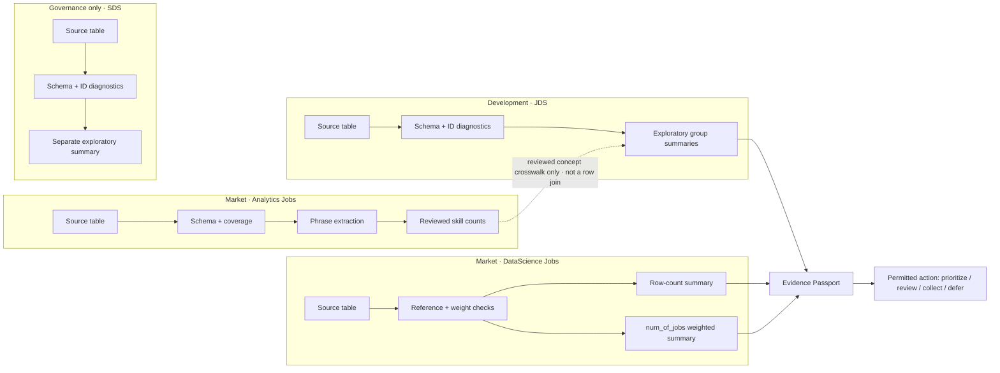

# Future Limit.less control-plane visualization

This is a **later platform integration plan**, not a connected dashboard feature. Build the SAS analysis and review its evidence first. The hosted app must not receive challenge data or derived results unless the organizer explicitly permits the exact transfer.

## Visual model

Use four readable evidence lanes and a compact operational console. The graph should be a clear lineage map, not a tangle of decorative edges:

SDS remains its own disconnected lane and has no arrow into individual recommendations. The aggregate output is only a proposed handoff until a real approval and integration exist.

## What the future Superadmin view should show

- A top status strip with VFL connection state, run ID, environment, and last verified time **only when returned by an authenticated status source**.
- Four separately namespaced source cards with filename, schema, row count, hash, freshness, missingness, and repeat-ID diagnostics only when a saved VFL run supplies them.
- Read-only grouped graph nodes and edges from a server-owned contract. Clicking a node opens its source, check version, execution time, evidence reference, result, caveat, and downstream impact.
- Exact gate states: `PASS`, `WARN`, `BLOCKED`, and `NOT RUN`. Staleness or offline state is shown separately. Missing evidence can never render green.
- A filterable, paginated run/event table from real, authorized run receipts. Until then, show a useful empty state and no fake logs or costs.
- An Evidence Passport that keeps coverage, semantic quality, statistical stability, and transportability separate, with denominator, method, limitation, reviewer, and next evidence.
- Minimal controls: dataset/status search, lane collapse, selected-path focus, reset/fit, and keyboard-operable node selection. No run/retry/export actions until the backend safely supports them.

## Non-negotiable boundaries

- No edges imply a shared row, person, employer, or time dimension across the four source files.
- The only possible Market↔JDS edge is a reviewer/versioned aggregate skill-family crosswalk and is explicitly non-causal.
- SDS has no graph, API, or action path to learner, hiring, ranking, or promotion decisions.
- The browser receives only approved aggregate run metadata; raw challenge values and row-level results remain in VFL.
- No VFL API token or user password is stored in the app. No direct connector is designed until the organizer confirms that the service/API and data-transfer terms allow it.
